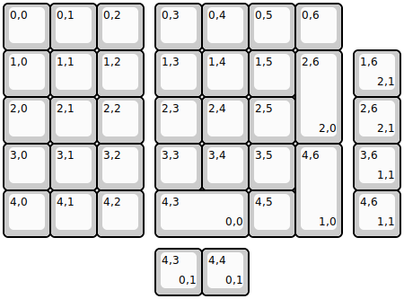
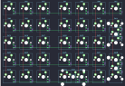

## ocean/addon

[layout](addon-kle.json) - [PCB](addon.kicad_pcb)

{:loading="lazy"}

[Open in keyboard-layout-editor](http://www.keyboard-layout-editor.com/##@@=0,0&=0,1&=0,2&_x:0.25;&=0,3&=0,4&=0,5&=0,6;&@=1,0&=1,1&=1,2&_x:0.25;&=1,3&=1,4&=1,5&_h:2;&=2,6%0A%0A%0A2,0;&@=2,0&=2,1&=2,2&_x:0.25;&=2,3&=2,4&=2,5;&@=3,0&=3,1&=3,2&_x:0.25;&=3,3&=3,4&=3,5&_h:2;&=4,6%0A%0A%0A1,0;&@=4,0&=4,1&=4,2&_x:0.25&w:2;&=4,3%0A%0A%0A0,0&=4,5;&@_x:7.5&y:-4;&=1,6%0A%0A%0A2,1;&@_x:7.5;&=2,6%0A%0A%0A2,1;&@_x:7.5;&=3,6%0A%0A%0A1,1;&@_x:7.5;&=4,6%0A%0A%0A1,1;&@_x:3.25&y:0.25;&=4,3%0A%0A%0A0,1&=4,4%0A%0A%0A0,1)

{:loading="lazy"}

