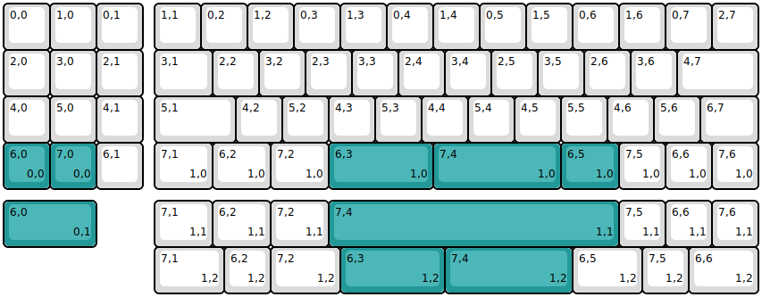
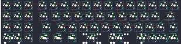

## ocean/gin_v2

[layout](gin_v2-kle.json) - [PCB](gin_v2.kicad_pcb)

{:loading="lazy"}

[Open in keyboard-layout-editor](http://www.keyboard-layout-editor.com/##@@_c=#dbdbdc;&=0,0&=1,0&=0,1&_x:0.25;&=1,1&=0,2&=1,2&=0,3&=1,3&=0,4&=1,4&=0,5&=1,5&=0,6&=1,6&=0,7&=2,7;&@=2,0&=3,0&=2,1&_x:0.25&w:1.25;&=3,1&=2,2&=3,2&=2,3&=3,3&=2,4&=3,4&=2,5&=3,5&=2,6&=3,6&_w:1.75;&=4,7;&@=4,0&=5,0&=4,1&_x:0.25&w:1.75;&=5,1&=4,2&=5,2&=4,3&=5,3&=4,4&=5,4&=4,5&=5,5&=4,6&=5,6&_w:1.25;&=6,7;&@_c=#239899;&=6,0%0A%0A%0A0,0&=7,0%0A%0A%0A0,0&_c=#dbdbdc;&=6,1&_x:0.25&w:1.25;&=7,1%0A%0A%0A1,0&_w:1.25;&=6,2%0A%0A%0A1,0&_w:1.25;&=7,2%0A%0A%0A1,0&_c=#239899&w:2.25;&=6,3%0A%0A%0A1,0&_w:2.75;&=7,4%0A%0A%0A1,0&_w:1.25;&=6,5%0A%0A%0A1,0&_c=#dbdbdc;&=7,5%0A%0A%0A1,0&=6,6%0A%0A%0A1,0&=7,6%0A%0A%0A1,0;&@_y:0.25&c=#239899&w:2;&=6,0%0A%0A%0A0,1&_x:1.25&c=#dbdbdc&w:1.25;&=7,1%0A%0A%0A1,1&_w:1.25;&=6,2%0A%0A%0A1,1&_w:1.25;&=7,2%0A%0A%0A1,1&_c=#239899&w:6.25;&=7,4%0A%0A%0A1,1&_c=#dbdbdc;&=7,5%0A%0A%0A1,1&=6,6%0A%0A%0A1,1&=7,6%0A%0A%0A1,1;&@_x:3.25&w:1.5;&=7,1%0A%0A%0A1,2&=6,2%0A%0A%0A1,2&_w:1.5;&=7,2%0A%0A%0A1,2&_c=#239899&w:2.25;&=6,3%0A%0A%0A1,2&_w:2.75;&=7,4%0A%0A%0A1,2&_c=#dbdbdc&w:1.5;&=6,5%0A%0A%0A1,2&=7,5%0A%0A%0A1,2&_w:1.5;&=6,6%0A%0A%0A1,2)

{:loading="lazy"}

