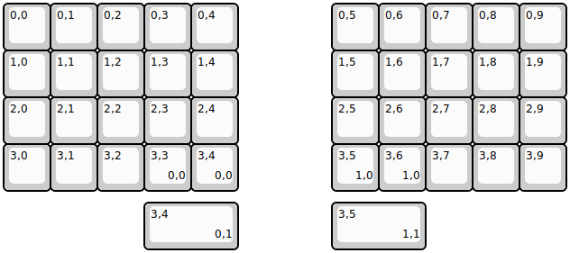
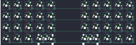

## ocean/slamz

[layout](slamz-kle.json) - [PCB](slamz.kicad_pcb)

{:loading="lazy"}

[Open in keyboard-layout-editor](http://www.keyboard-layout-editor.com/##@@=0,0&=0,1&=0,2&=0,3&=0,4&_x:2;&=0,5&=0,6&=0,7&=0,8&=0,9;&@=1,0&=1,1&=1,2&=1,3&=1,4&_x:2;&=1,5&=1,6&=1,7&=1,8&=1,9;&@=2,0&=2,1&=2,2&=2,3&=2,4&_x:2;&=2,5&=2,6&=2,7&=2,8&=2,9;&@=3,0&=3,1&=3,2&=3,3%0A%0A%0A0,0&=3,4%0A%0A%0A0,0&_x:2;&=3,5%0A%0A%0A1,0&=3,6%0A%0A%0A1,0&=3,7&=3,8&=3,9;&@_x:3&y:0.25&w:2;&=3,4%0A%0A%0A0,1&_x:2&w:2;&=3,5%0A%0A%0A1,1)

{:loading="lazy"}

