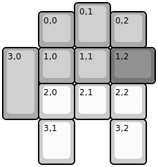
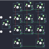

## ocean/sus

[layout](sus-kle.json) - [PCB](sus.kicad_pcb)

{:loading="lazy"}

[Open in keyboard-layout-editor](http://www.keyboard-layout-editor.com/##@@_x:2&c=#aaaaaa&h:1.25;&=0,1;&@_x:1&y:-0.75;&=0,0&_x:1;&=0,2;&@_h:2;&=3,0&=1,0&=1,1&_c=#777777&w:1.25;&=1,2;&@_x:1&c=#cccccc;&=2,0&=2,1&=2,2;&@_x:1&h:1.25;&=3,1&_x:1&h:1.25;&=3,2)

{:loading="lazy"}

