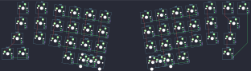

## ocean/wang_ergo

[layout](wang_ergo-kle.json) - [PCB](wang_ergo.kicad_pcb)

{:loading="lazy"}

[Open in keyboard-layout-editor](http://www.keyboard-layout-editor.com/##@@_x:1.75&y:2.25&c=#dbdbdc;&=0,0&_x:12.4;&=0,11&=3,10;&@_x:1.5&w:1.25;&=1,0&_x:12.4&w:1.75;&=1,11;&@_x:1&w:1.75;&=2,0&_x:12.4&w:1.25;&=2,11;&@_x:0.75;&=3,0&=3,1&_x:12.4;&=3,11;&@_r:4&x:3.15&y:-4.25;&=0,1;&@_x:3.15;&=1,1;&@_x:3.15;&=2,1;&@_r:8&x:4.5&y:-3.25;&=0,2&=0,3&=0,4&=0,5;&@_x:4.5;&=1,2&=1,3&=1,4&=1,5;&@_x:4.5;&=2,2&=2,3&=2,4&=2,5;&@_x:5.5;&=3,3&_w:2;&=3,5%0A%0A%0A0,0;&@_r:-8&x:9.25&y:-1.5;&=0,6&=0,7&=0,8&=0,9;&@_x:9.25;&=1,6&=1,7&=1,8&=1,9;&@_x:9.25;&=2,6&=2,7&=2,8&=2,9;&@_x:9.25&w:2;&=3,6%0A%0A%0A1,0&=3,8;&@_r:-4&x:13.75&y:-5.0;&=0,10;&@_x:13.75;&=1,10;&@_x:13.75;&=2,10;&@_r:8&x:6.5&y:-0.25;&=3,4%0A%0A%0A0,1&=3,5%0A%0A%0A0,1;&@_r:-8&x:9.25&y:1.5;&=3,6%0A%0A%0A1,1&=3,7%0A%0A%0A1,1)

{:loading="lazy"}

