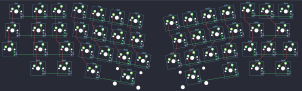

## ocean/yuri

[layout](yuri-kle.json) - [PCB](yuri.kicad_pcb)

{:loading="lazy"}

[Open in keyboard-layout-editor](http://www.keyboard-layout-editor.com/##@@_x:14.25&y:3.55;&=0,11;&@_x:2.05&y:-0.95;&=0,0&_x:0.25;&=0,1&=0,2&_x:9.95;&=0,12&=0,13;&@_x:1.85;&=1,0&_x:0.25&w:1.25;&=1,1&=1,2&_x:9.35;&=1,11&_w:1.75;&=1,12;&@_x:1.7;&=2,0&_x:0.25&w:1.75;&=2,1&=2,2&_x:8.65;&=2,11&=2,12&_w:1.25;&=2,13;&@_x:2.95&w:1.5;&=3,1&_w:1.25;&=3,2&_x:8.9&w:1.25;&=3,12&_w:1.5;&=3,13;&@_r:10&x:6&y:-5.1;&=0,3&=0,4&=0,5&=0,6;&@_x:6.25;&=1,3&=1,4&=1,5&=1,6;&@_x:6.75;&=2,3&=2,4&=2,5&=2,6;&@_x:7&w:1.5;&=3,3&_w:2.25;&=3,5;&@_r:-10&x:9.25&y:-0.5;&=0,7&=0,8&=0,9&=0,10;&@_x:9.5;&=1,7&=1,8&=1,9&=1,10;&@_x:9;&=2,7&=2,8&=2,9&=2,10;&@_x:9&w:2.75;&=3,8&_w:1.25;&=3,10)

{:loading="lazy"}

