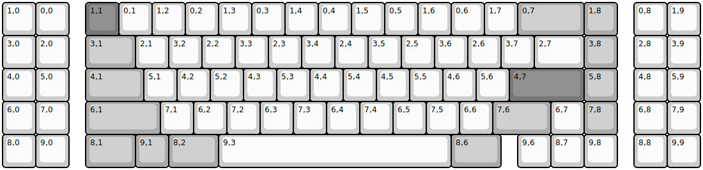
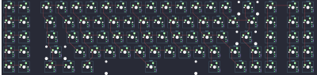

## odelia/odelia

[layout](odelia-kle.json) - [PCB](odelia.kicad_pcb)

{:loading="lazy"}

[Open in keyboard-layout-editor](http://www.keyboard-layout-editor.com/##@@=1,0&=0,0&_x:0.5&c=#777777;&=1,1&_c=#cccccc;&=0,1&=1,2&=0,2&=1,3&=0,3&=1,4&=0,4&=1,5&=0,5&=1,6&=0,6&=1,7&_c=#aaaaaa&w:2;&=0,7&=1,8&_x:0.5&c=#cccccc;&=0,8&=1,9;&@=3,0&=2,0&_x:0.5&c=#aaaaaa&w:1.5;&=3,1&_c=#cccccc;&=2,1&=3,2&=2,2&=3,3&=2,3&=3,4&=2,4&=3,5&=2,5&=3,6&=2,6&=3,7&_w:1.5;&=2,7&_c=#aaaaaa;&=3,8&_x:0.5&c=#cccccc;&=2,8&=3,9;&@=4,0&=5,0&_x:0.5&c=#aaaaaa&w:1.75;&=4,1&_c=#cccccc;&=5,1&=4,2&=5,2&=4,3&=5,3&=4,4&=5,4&=4,5&=5,5&=4,6&=5,6&_c=#777777&w:2.25;&=4,7&_c=#aaaaaa;&=5,8&_x:0.5&c=#cccccc;&=4,8&=5,9;&@=6,0&=7,0&_x:0.5&c=#aaaaaa&w:2.25;&=6,1&_c=#cccccc;&=7,1&=6,2&=7,2&=6,3&=7,3&=6,4&=7,4&=6,5&=7,5&=6,6&_c=#aaaaaa&w:1.75;&=7,6&_c=#cccccc;&=6,7&_c=#aaaaaa;&=7,8&_x:0.5&c=#cccccc;&=6,8&=7,9;&@=8,0&=9,0&_x:0.5&c=#aaaaaa&w:1.5;&=8,1&=9,1&_w:1.5;&=8,2&_c=#cccccc&w:7;&=9,3&_c=#aaaaaa&w:1.5;&=8,6&_x:0.5&c=#cccccc;&=9,6&=8,7&=9,8&_x:0.5;&=8,8&=9,9)

{:loading="lazy"}

