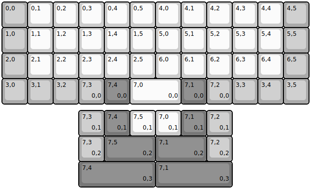
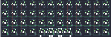

## olkb/planck/rev6/olkb-planck-rev6.1

[layout](olkb-planck-rev6.1-kle.json) - [PCB](olkb-planck-rev6.1.kicad_pcb)

{:loading="lazy"}

[Open in keyboard-layout-editor](http://www.keyboard-layout-editor.com/##@@_c=#aaaaaa;&=0,0&_c=#cccccc;&=0,1&=0,2&=0,3&=0,4&=0,5&=4,0&=4,1&=4,2&=4,3&=4,4&_c=#aaaaaa;&=4,5;&@=1,0&_c=#cccccc;&=1,1&=1,2&=1,3&=1,4&=1,5&=5,0&=5,1&=5,2&=5,3&=5,4&_c=#aaaaaa;&=5,5;&@=2,0&_c=#cccccc;&=2,1&=2,2&=2,3&=2,4&=2,5&=6,0&=6,1&=6,2&=6,3&=6,4&_c=#aaaaaa;&=6,5;&@=3,0&=3,1&=3,2&=7,3%0A%0A%0A0,0&_c=#777777;&=7,4%0A%0A%0A0,0&_c=#cccccc&w:2;&=7,0%0A%0A%0A0,0&_c=#777777;&=7,1%0A%0A%0A0,0&_c=#aaaaaa;&=7,2%0A%0A%0A0,0&=3,3&=3,4&=3,5;&@_x:3&y:0.25;&=7,3%0A%0A%0A0,1&_c=#777777;&=7,4%0A%0A%0A0,1&_c=#cccccc;&=7,5%0A%0A%0A0,1&=7,0%0A%0A%0A0,1&_c=#777777;&=7,1%0A%0A%0A0,1&_c=#aaaaaa;&=7,2%0A%0A%0A0,1;&@_x:3;&=7,3%0A%0A%0A0,2&_c=#777777&w:2;&=7,5%0A%0A%0A0,2&_w:2;&=7,1%0A%0A%0A0,2&_c=#aaaaaa;&=7,2%0A%0A%0A0,2;&@_x:3&c=#777777&w:3;&=7,4%0A%0A%0A0,3&_w:3;&=7,1%0A%0A%0A0,3)

{:loading="lazy"}

