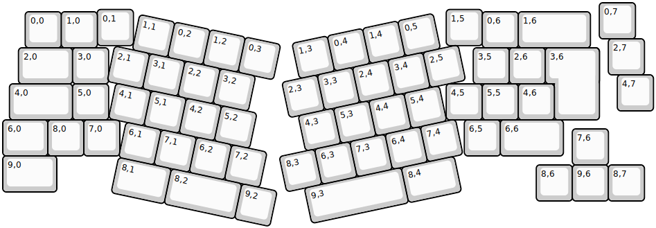
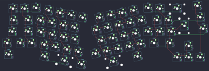

## olli_works/neito

[layout](neito-kle.json) - [PCB](neito.kicad_pcb)

{:loading="lazy"}

[Open in keyboard-layout-editor](http://www.keyboard-layout-editor.com/##@@_x:16.5625;&=0,7;&@_x:2.625&y:-0.8125;&=0,1&_x:8.6875;&=1,5;&@_x:0.625&y:-0.9375;&=0,0&=1,0&_x:10.6875;&=0,6&_w:2;&=1,6;&@_x:16.8125&y:-0.25;&=2,7;&@_x:0.4375&y:-0.75&w:1.5;&=2,0&=3,0&_x:10.125;&=3,5&=2,6&_x:0.25&w:1.25&h:2&w2:1.5&h2:1&x2:-0.25;&=3,6;&@_x:17.0625&y:-0.25;&=4,7;&@_x:0.1875&y:-0.75&w:1.75;&=4,0&=5,0&_x:9.375;&=4,5&=5,5&=4,6;&@_w:1.25;&=6,0&=8,0&=7,0&_x:9.565;&=6,5&_x:-0.0025&w:1.75;&=6,6;&@_x:15.8125&y:-0.75;&=7,6;&@_y:-0.25&w:1.5;&=9,0;&@_x:14.8125&y:-0.75;&=8,6&=9,6&=8,7;&@_r:12&rx:3.125&ry:1.1875&x:0.5&y:-1.0;&=1,1&=0,2&=1,2&=0,3;&@=2,1&=3,1&=2,2&=3,2;&@_x:0.25;&=4,1&=5,1&=4,2&=5,2;&@_x:0.75;&=6,1&=7,1&=6,2&=7,2;&@_x:0.75&w:1.5;&=8,1&_w:2;&=8,2&=9,2;&@_r:-12&rx:12.625&x:-4.5&y:-1.0;&=1,3&=0,4&=1,4&=0,5;&@_x:-5.0;&=2,3&=3,3&=2,4&=3,4&=2,5;&@_x:-4.75;&=4,3&=5,3&=4,4&=5,4;&@_x:-5.5;&=8,3&=6,3&=7,3&=6,4&=7,4;&@_x:-5.0&w:2.75;&=9,3&_w:1.5;&=8,4)

{:loading="lazy"}

