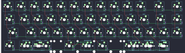

## onekeyco/dango40

[layout](dango40-kle.json) - [PCB](dango40.kicad_pcb)

{:loading="lazy"}

[Open in keyboard-layout-editor](http://www.keyboard-layout-editor.com/##@@_c=#777777;&=0,0&_c=#cccccc;&=0,1&=0,2&=0,3&=0,4&=0,5&=0,6&=0,7&=0,8&=0,9&=0,10&_c=#aaaaaa&w:1.75;&=0,11&=0,12;&@_w:1.25;&=1,0&_c=#cccccc;&=1,1&=1,2&=1,3&=1,4&=1,5&=1,6&=1,7&=1,8&=1,9&_c=#aaaaaa;&=1,10&_c=#777777&w:1.5;&=1,11&_c=#aaaaaa;&=1,12;&@_w:1.75;&=2,0&_c=#cccccc;&=2,1&=2,2&=2,3&=2,4&=2,5&=2,6&=2,7&_c=#aaaaaa;&=2,8&=2,9&=2,10&=2,11&=2,12;&@_w:1.25;&=3,0%0A%0A%0A0,0&_w:1.5;&=3,1%0A%0A%0A0,0&_w:1.25;&=3,2%0A%0A%0A0,0&_w:2.25;&=3,4%0A%0A%0A0,0&_w:2.75;&=3,6%0A%0A%0A0,0&_w:1.25;&=3,7%0A%0A%0A0,0&_w:1.25;&=3,9%0A%0A%0A0,0&_w:1.25;&=3,10%0A%0A%0A0,0;&@_y:0.25&w:1.25;&=3,0%0A%0A%0A0,1&=3,1%0A%0A%0A0,1&=3,2%0A%0A%0A0,1&_w:6.25;&=3,4%0A%0A%0A0,1&=3,7%0A%0A%0A0,1&_w:1.25;&=3,9%0A%0A%0A0,1&=3,10%0A%0A%0A0,1;&@_w:1.25;&=3,0%0A%0A%0A0,2&=3,1%0A%0A%0A0,2&_w:1.25;&=3,2%0A%0A%0A0,2&_w:6.25;&=3,4%0A%0A%0A0,2&=3,7%0A%0A%0A0,2&=3,9%0A%0A%0A0,2&=3,11%0A%0A%0A0,2)

{:loading="lazy"}

