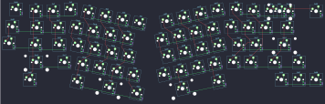

## other/bear_65

[layout](bear_65-kle.json) - [PCB](bear_65.kicad_pcb)

{:loading="lazy"}

[Open in keyboard-layout-editor](http://www.keyboard-layout-editor.com/##@@_x:0.55&y:1.15&c=#aaaaaa;&=3,1&_x:2.15&c=#cccccc;&=0,2&_x:8.55;&=0,11;&@_x:1.7&y:-0.9&c=#777777;&=0,0&_c=#cccccc;&=0,1&_x:10.55;&=0,12&_c=#aaaaaa&w:2;&=0,13%0A%0A%0A0,0&_x:0.6;&=4,14;&@_x:0.35&y:-0.1;&=1,14&_x:11.6&c=#cccccc;&=1,10;&@_x:1.5&y:-0.95&c=#aaaaaa&w:1.5;&=1,0&_c=#cccccc;&=1,1&_x:9.95;&=1,11&=1,12&_c=#aaaaaa&w:1.5;&=1,13;&@_x:0.15&y:-0.1;&=2,14;&@_x:1.3&y:-0.9&w:1.75;&=2,0&_c=#cccccc;&=2,1&_x:9.35;&=2,10&=2,11&_c=#aaaaaa&w:2.25;&=2,13;&@_x:1.1&w:2.25;&=3,0&_c=#cccccc;&=3,2&_x:8.75;&=3,11&=3,12&_c=#aaaaaa&w:1.75;&=3,13&_c=#777777;&=3,14;&@_x:1.1&c=#aaaaaa&w:1.5;&=4,0&_x:13.25&c=#777777;&=4,11&=4,12&=4,13;&@_r:12&x:5&y:-6.0&c=#cccccc;&=0,3&=0,4&=0,5&=0,6;&@_x:4.5;&=1,2&=1,3&=1,4&=1,5;&@_x:4.8;&=2,2&=2,3&=2,4&=2,5;&@_x:5.3;&=3,3&=3,4&=3,5&=3,6;&@_x:6.45&w:2.25;&=4,5&_c=#aaaaaa;&=4,6;&@_x:4.95&y:-0.95&w:1.5;&=4,3;&@_r:-12&x:8.55&y:-1.45&c=#cccccc;&=0,7&=0,8&=0,9&=0,10;&@_x:8.05;&=1,6&=1,7&=1,8&=1,9;&@_x:8.2;&=2,6&=2,7&=2,8&=2,9;&@_x:7.75;&=3,7&=3,8&=3,9&=3,10;&@_x:7.75&w:2.75;&=4,8;&@_x:10.5&y:-0.95&c=#aaaaaa&w:1.5;&=4,10;&@_r:0&x:15.25&y:-8.85&c=#cccccc;&=0,13%0A%0A%0A0,1&=0,14%0A%0A%0A0,1)

{:loading="lazy"}

