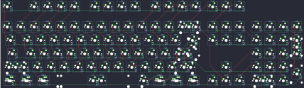

## other/chili

[layout](chili-kle.json) - [PCB](chili.kicad_pcb)

{:loading="lazy"}

[Open in keyboard-layout-editor](http://www.keyboard-layout-editor.com/##@@_c=#777777;&=0,0&_x:1&c=#cccccc;&=0,1&=0,2&=0,3&=0,4&_x:0.5;&=0,5&=0,6&=0,7&=0,8&_x:0.5;&=0,9&=6,9&=6,8&=6,7&_x:0.25&c=#aaaaaa;&=6,6&=6,5&=6,4;&@_y:0.5&c=#cccccc;&=1,0&=1,1&=1,2&=1,3&=1,4&=1,5&=1,6&=1,7&=1,8&=1,9&=7,9&=7,8&=7,7&_c=#aaaaaa&w:2;&=7,6%0A%0A%0A0,0&_x:0.25;&=7,4&=7,3&=7,2&_x:0.25;&=6,3&=6,2&=6,1&=6,0;&@_w:1.5;&=2,0&_c=#cccccc;&=2,1&=2,2&=2,3&=2,4&=2,5&=2,6&=2,7&=2,8&=2,9&=8,9&=8,8&=8,7&_c=#aaaaaa&w:1.5;&=8,6%0A%0A%0A1,0&_x:0.25;&=8,5&=8,4&=8,3&_x:0.25&c=#cccccc;&=8,2&=8,1&=8,0&_h:2;&=9,0%0A%0A%0A4,0;&@_c=#aaaaaa&w:1.75;&=3,0&_c=#cccccc;&=3,1&=3,2&=3,3&=3,4&=3,5&=3,6&=3,7&=3,8&=3,9&=9,9&=9,8&_c=#777777&w:2.25;&=9,7%0A%0A%0A1,0&_x:3.5&c=#cccccc;&=9,5&=9,2&=7,1;&@_c=#aaaaaa&w:2.25;&=4,0%0A%0A%0A2,0&_c=#cccccc;&=4,2&=4,3&=4,4&=4,5&=4,6&=4,7&=4,8&=4,9&=10,9&=10,8&_c=#aaaaaa&w:2.75;&=10,7%0A%0A%0A3,0&_x:1.25&c=#777777;&=9,6&_x:1.25&c=#cccccc;&=9,4&=9,3&=9,1&_c=#777777&h:2;&=10,0;&@_c=#aaaaaa&w:1.25;&=5,0%0A%0A%0A6,0&_w:1.25;&=5,1%0A%0A%0A6,0&_w:1.25;&=5,2%0A%0A%0A6,0&_c=#cccccc&w:6.25;&=5,4%0A%0A%0A6,0&_c=#aaaaaa&w:1.25;&=5,5%0A%0A%0A6,0&_w:1.25;&=5,6%0A%0A%0A6,0&_w:1.25;&=5,7%0A%0A%0A6,0&_w:1.25;&=5,8%0A%0A%0A6,0&_x:0.25&c=#777777;&=5,9&=10,5&=10,4&_x:0.25&c=#cccccc&w:2;&=10,3%0A%0A%0A5,0&=10,1;&@_x:22.75&y:-5.0&c=#aaaaaa;&=7,6%0A%0A%0A0,1&=7,5%0A%0A%0A0,1;&@_x:23.75&c=#777777&w:1.25&h:2&w2:1.5&h2:1&x2:-0.25;&=9,7%0A%0A%0A1,1&_x:0.25&c=#cccccc;&=9,0%0A%0A%0A4,1;&@_x:22.75;&=8,6%0A%0A%0A1,1&_x:1.5;&=7,0%0A%0A%0A4,1;&@_x:22.75&c=#aaaaaa&w:1.25;&=4,0%0A%0A%0A2,1&_c=#cccccc;&=4,1%0A%0A%0A2,1&_x:0.25;&=10,6%0A%0A%0A3,1&_c=#aaaaaa&w:1.75;&=10,7%0A%0A%0A3,1;&@_y:1.25&w:1.5;&=5,0%0A%0A%0A6,1&=5,1%0A%0A%0A6,1&_w:1.5;&=5,2%0A%0A%0A6,1&_c=#cccccc&w:7;&=5,4%0A%0A%0A6,1&_c=#aaaaaa&w:1.5;&=5,5%0A%0A%0A6,1&=5,6%0A%0A%0A6,1&_w:1.5;&=5,8%0A%0A%0A6,1&_x:3.5&c=#cccccc;&=10,3%0A%0A%0A5,1&=10,2%0A%0A%0A5,1)

{:loading="lazy"}

