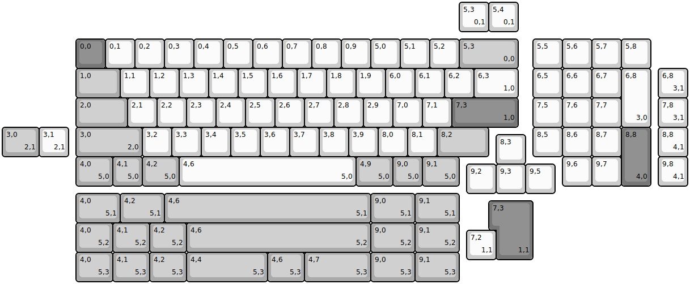
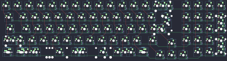

## other/cypher/cypherRev5

[layout](cypherRev5-kle.json) - [PCB](cypherRev5.kicad_pcb)

{:loading="lazy"}

[Open in keyboard-layout-editor](http://www.keyboard-layout-editor.com/##@@_x:2.5&y:1.25&c=#777777;&=0,0&_c=#cccccc;&=0,1&=0,2&=0,3&=0,4&=0,5&=0,6&=0,7&=0,8&=0,9&=5,0&=5,1&=5,2&_c=#aaaaaa&w:2;&=5,3%0A%0A%0A0,0&_x:0.5&c=#cccccc;&=5,5&=5,6&=5,7&=5,8;&@_x:2.5&c=#aaaaaa&w:1.5;&=1,0&_c=#cccccc;&=1,1&=1,2&=1,3&=1,4&=1,5&=1,6&=1,7&=1,8&=1,9&=6,0&=6,1&=6,2&_w:1.5;&=6,3%0A%0A%0A1,0&_x:0.5;&=6,5&=6,6&=6,7&_h:2;&=6,8%0A%0A%0A3,0;&@_x:2.5&c=#aaaaaa&w:1.75;&=2,0&_c=#cccccc;&=2,1&=2,2&=2,3&=2,4&=2,5&=2,6&=2,7&=2,8&=2,9&=7,0&=7,1&_c=#777777&w:2.25;&=7,3%0A%0A%0A1,0&_x:0.5&c=#cccccc;&=7,5&=7,6&=7,7;&@_x:2.5&c=#aaaaaa&w:2.25;&=3,0%0A%0A%0A2,0&_c=#cccccc;&=3,2&=3,3&=3,4&=3,5&=3,6&=3,7&=3,8&=3,9&=8,0&=8,1&_c=#aaaaaa&w:1.75;&=8,2&_x:1.5&c=#cccccc;&=8,5&=8,6&=8,7&_c=#777777&h:2;&=8,8%0A%0A%0A4,0;&@_x:16.75&y:-0.75&c=#cccccc;&=8,3;&@_x:2.5&y:-0.25&c=#aaaaaa&w:1.25;&=4,0%0A%0A%0A5,0&=4,1%0A%0A%0A5,0&_w:1.25;&=4,2%0A%0A%0A5,0&_c=#cccccc&w:6;&=4,6%0A%0A%0A5,0&_c=#aaaaaa&w:1.25;&=4,9%0A%0A%0A5,0&=9,0%0A%0A%0A5,0&_w:1.25;&=9,1%0A%0A%0A5,0&_x:3.5&c=#cccccc;&=9,6&=9,7;&@_x:15.75&y:-0.75;&=9,2&=9,3&=9,5;&@_x:15.5&y:-6.5;&=5,3%0A%0A%0A0,1&=5,4%0A%0A%0A0,1;&@_x:22.25&y:1.25;&=6,8%0A%0A%0A3,1;&@_x:22.25;&=7,8%0A%0A%0A3,1;&@_c=#aaaaaa&w:1.25;&=3,0%0A%0A%0A2,1&_c=#cccccc;&=3,1%0A%0A%0A2,1&_x:20.0;&=8,8%0A%0A%0A4,1;&@_x:22.25;&=9,8%0A%0A%0A4,1;&@_x:2.5&y:0.25&c=#aaaaaa&w:1.5;&=4,0%0A%0A%0A5,1&_w:1.5;&=4,2%0A%0A%0A5,1&_w:7;&=4,6%0A%0A%0A5,1&_w:1.5;&=9,0%0A%0A%0A5,1&_w:1.5;&=9,1%0A%0A%0A5,1;&@_x:16.75&y:-0.75&c=#777777&w:1.25&h:2&w2:1.5&h2:1&x2:-0.25;&=7,3%0A%0A%0A1,1;&@_x:2.5&y:-0.25&c=#aaaaaa&w:1.25;&=4,0%0A%0A%0A5,2&_w:1.25;&=4,1%0A%0A%0A5,2&_w:1.25;&=4,2%0A%0A%0A5,2&_w:6.25;&=4,6%0A%0A%0A5,2&_w:1.5;&=9,0%0A%0A%0A5,2&_w:1.5;&=9,1%0A%0A%0A5,2;&@_x:15.75&y:-0.75&c=#cccccc;&=7,2%0A%0A%0A1,1;&@_x:2.5&y:-0.25&c=#aaaaaa&w:1.25;&=4,0%0A%0A%0A5,3&_w:1.25;&=4,1%0A%0A%0A5,3&_w:1.25;&=4,2%0A%0A%0A5,3&_w:2.75;&=4,4%0A%0A%0A5,3&_w:1.25;&=4,6%0A%0A%0A5,3&_w:2.25;&=4,7%0A%0A%0A5,3&_w:1.5;&=9,0%0A%0A%0A5,3&_w:1.5;&=9,1%0A%0A%0A5,3)

{:loading="lazy"}

