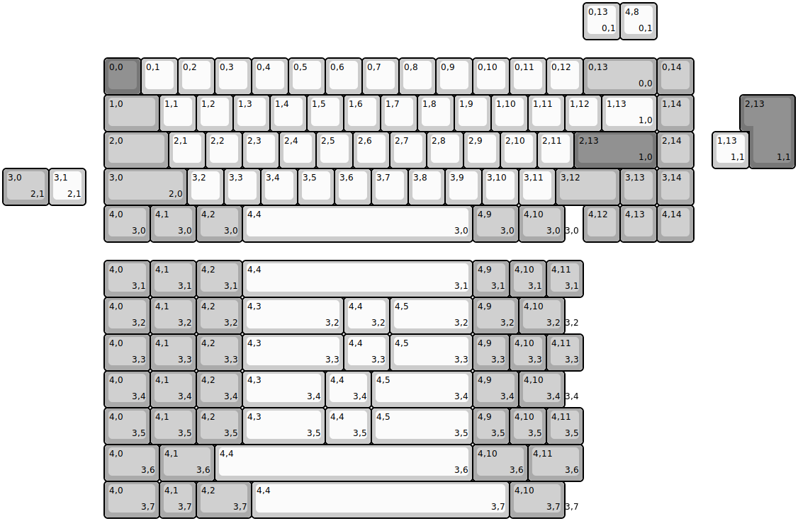
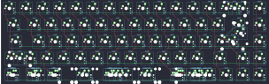
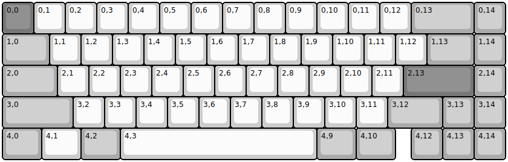
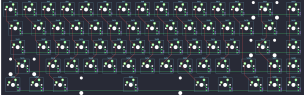
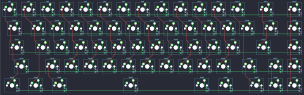

## other/doro67/doro67multi

[layout](doro67multi-kle.json) - [PCB](doro67multi.kicad_pcb)

{:loading="lazy"}

[Open in keyboard-layout-editor](http://www.keyboard-layout-editor.com/##@@_x:2.75&y:1.5&c=#777777;&=0,0&_c=#cccccc;&=0,1&=0,2&=0,3&=0,4&=0,5&=0,6&=0,7&=0,8&=0,9&=0,10&=0,11&=0,12&_c=#aaaaaa&w:2;&=0,13%0A%0A%0A0,0&=0,14;&@_x:2.75&w:1.5;&=1,0&_c=#cccccc;&=1,1&=1,2&=1,3&=1,4&=1,5&=1,6&=1,7&=1,8&=1,9&=1,10&=1,11&=1,12&_w:1.5;&=1,13%0A%0A%0A1,0&_c=#aaaaaa;&=1,14;&@_x:2.75&w:1.75;&=2,0&_c=#cccccc;&=2,1&=2,2&=2,3&=2,4&=2,5&=2,6&=2,7&=2,8&=2,9&=2,10&=2,11&_c=#777777&w:2.25;&=2,13%0A%0A%0A1,0&_c=#aaaaaa;&=2,14;&@_x:2.75&w:2.25;&=3,0%0A%0A%0A2,0&_c=#cccccc;&=3,2&=3,3&=3,4&=3,5&=3,6&=3,7&=3,8&=3,9&=3,10&=3,11&_c=#aaaaaa&w:1.75;&=3,12&=3,13&=3,14;&@_x:2.75&w:1.25;&=4,0%0A%0A%0A3,0&_w:1.25;&=4,1%0A%0A%0A3,0&_w:1.25;&=4,2%0A%0A%0A3,0&_c=#cccccc&w:6.25;&=4,4%0A%0A%0A3,0&_c=#aaaaaa&w:1.25;&=4,9%0A%0A%0A3,0&_w:1.25;&=4,10%0A%0A%0A3,0&_c=#cccccc&w:0.5&d:true;&=%0A%0A%0A3,0&_c=#aaaaaa;&=4,12&=4,13&=4,14;&@_x:15.75&y:-6.5&c=#cccccc;&=0,13%0A%0A%0A0,1&=4,8%0A%0A%0A0,1;&@_x:20.25&y:1.5&c=#777777&w:1.25&h:2&w2:1.5&h2:1&x2:-0.25;&=2,13%0A%0A%0A1,1;&@_x:19.25&c=#cccccc;&=1,13%0A%0A%0A1,1;&@_c=#aaaaaa&w:1.25;&=3,0%0A%0A%0A2,1&_c=#cccccc;&=3,1%0A%0A%0A2,1;&@_x:2.75&y:1.5&c=#aaaaaa&w:1.25;&=4,0%0A%0A%0A3,1&_w:1.25;&=4,1%0A%0A%0A3,1&_w:1.25;&=4,2%0A%0A%0A3,1&_c=#cccccc&w:6.25;&=4,4%0A%0A%0A3,1&_c=#aaaaaa;&=4,9%0A%0A%0A3,1&=4,10%0A%0A%0A3,1&=4,11%0A%0A%0A3,1;&@_x:2.75&w:1.25;&=4,0%0A%0A%0A3,2&_w:1.25;&=4,1%0A%0A%0A3,2&_w:1.25;&=4,2%0A%0A%0A3,2&_c=#cccccc&w:2.75;&=4,3%0A%0A%0A3,2&_w:1.25;&=4,4%0A%0A%0A3,2&_w:2.25;&=4,5%0A%0A%0A3,2&_c=#aaaaaa&w:1.25;&=4,9%0A%0A%0A3,2&_w:1.25;&=4,10%0A%0A%0A3,2&_c=#cccccc&w:0.5&d:true;&=%0A%0A%0A3,2;&@_x:2.75&c=#aaaaaa&w:1.25;&=4,0%0A%0A%0A3,3&_w:1.25;&=4,1%0A%0A%0A3,3&_w:1.25;&=4,2%0A%0A%0A3,3&_c=#cccccc&w:2.75;&=4,3%0A%0A%0A3,3&_w:1.25;&=4,4%0A%0A%0A3,3&_w:2.25;&=4,5%0A%0A%0A3,3&_c=#aaaaaa;&=4,9%0A%0A%0A3,3&=4,10%0A%0A%0A3,3&=4,11%0A%0A%0A3,3;&@_x:2.75&w:1.25;&=4,0%0A%0A%0A3,4&_w:1.25;&=4,1%0A%0A%0A3,4&_w:1.25;&=4,2%0A%0A%0A3,4&_c=#cccccc&w:2.25;&=4,3%0A%0A%0A3,4&_w:1.25;&=4,4%0A%0A%0A3,4&_w:2.75;&=4,5%0A%0A%0A3,4&_c=#aaaaaa&w:1.25;&=4,9%0A%0A%0A3,4&_w:1.25;&=4,10%0A%0A%0A3,4&_c=#cccccc&w:0.5&d:true;&=%0A%0A%0A3,4;&@_x:2.75&c=#aaaaaa&w:1.25;&=4,0%0A%0A%0A3,5&_w:1.25;&=4,1%0A%0A%0A3,5&_w:1.25;&=4,2%0A%0A%0A3,5&_c=#cccccc&w:2.25;&=4,3%0A%0A%0A3,5&_w:1.25;&=4,4%0A%0A%0A3,5&_w:2.75;&=4,5%0A%0A%0A3,5&_c=#aaaaaa;&=4,9%0A%0A%0A3,5&=4,10%0A%0A%0A3,5&=4,11%0A%0A%0A3,5;&@_x:2.75&w:1.5;&=4,0%0A%0A%0A3,6&_w:1.5;&=4,1%0A%0A%0A3,6&_c=#cccccc&w:7;&=4,4%0A%0A%0A3,6&_c=#aaaaaa&w:1.5;&=4,10%0A%0A%0A3,6&_w:1.5;&=4,11%0A%0A%0A3,6;&@_x:2.75&w:1.5;&=4,0%0A%0A%0A3,7&=4,1%0A%0A%0A3,7&_w:1.5;&=4,2%0A%0A%0A3,7&_c=#cccccc&w:7;&=4,4%0A%0A%0A3,7&_c=#aaaaaa&w:1.5;&=4,10%0A%0A%0A3,7&_c=#cccccc&w:0.5&d:true;&=%0A%0A%0A3,7)

{:loading="lazy"}

## other/doro67/doro67regular

[layout](doro67regular-kle.json) - [PCB](doro67regular.kicad_pcb)

{:loading="lazy"}

[Open in keyboard-layout-editor](http://www.keyboard-layout-editor.com/##@@_c=#777777;&=0,0&_c=#cccccc;&=0,1&=0,2&=0,3&=0,4&=0,5&=0,6&=0,7&=0,8&=0,9&=0,10&=0,11&=0,12&_c=#aaaaaa&w:2;&=0,13&=0,14;&@_w:1.5;&=1,0&_c=#cccccc;&=1,1&=1,2&=1,3&=1,4&=1,5&=1,6&=1,7&=1,8&=1,9&=1,10&=1,11&=1,12&_c=#aaaaaa&w:1.5;&=1,13&=1,14;&@_w:1.75;&=2,0&_c=#cccccc;&=2,1&=2,2&=2,3&=2,4&=2,5&=2,6&=2,7&=2,8&=2,9&=2,10&=2,11&_c=#777777&w:2.25;&=2,13&_c=#aaaaaa;&=2,14;&@_w:2.25;&=3,0&_c=#cccccc;&=3,2&=3,3&=3,4&=3,5&=3,6&=3,7&=3,8&=3,9&=3,10&=3,11&_c=#aaaaaa&w:1.75;&=3,12&=3,13&=3,14;&@_w:1.25;&=4,0&_c=#cccccc&w:1.25;&=4,1&_c=#aaaaaa&w:1.25;&=4,2&_c=#cccccc&w:6.25;&=4,3&_c=#aaaaaa&w:1.25;&=4,9&_w:1.25;&=4,10&_x:0.5;&=4,12&=4,13&=4,14)

{:loading="lazy"}

## other/doro67/doro67rgb

[layout](doro67rgb-kle.json) - [PCB](doro67rgb.kicad_pcb)

{:loading="lazy"}

[Open in keyboard-layout-editor](http://www.keyboard-layout-editor.com/##@@_c=#777777;&=0,0&_c=#cccccc;&=0,1&=0,2&=0,3&=0,4&=0,5&=0,6&=0,7&=0,8&=0,9&=0,10&=0,11&=0,12&_c=#aaaaaa&w:2;&=0,13&=0,14;&@_w:1.5;&=1,0&_c=#cccccc;&=1,1&=1,2&=1,3&=1,4&=1,5&=1,6&=1,7&=1,8&=1,9&=1,10&=1,11&=1,12&_c=#aaaaaa&w:1.5;&=1,13&=1,14;&@_w:1.75;&=2,0&_c=#cccccc;&=2,1&=2,2&=2,3&=2,4&=2,5&=2,6&=2,7&=2,8&=2,9&=2,10&=2,11&_c=#777777&w:2.25;&=2,13&_c=#aaaaaa;&=2,14;&@_w:2.25;&=3,0&_c=#cccccc;&=3,2&=3,3&=3,4&=3,5&=3,6&=3,7&=3,8&=3,9&=3,10&=3,11&_c=#aaaaaa&w:1.75;&=3,12&=3,13&=3,14;&@_w:1.25;&=4,0&_c=#cccccc&w:1.25;&=4,1&_c=#aaaaaa&w:1.25;&=4,2&_c=#cccccc&w:6.25;&=4,3&_c=#aaaaaa&w:1.25;&=4,9&_w:1.25;&=4,10&_x:0.5;&=4,12&=4,13&=4,14)

{:loading="lazy"}

