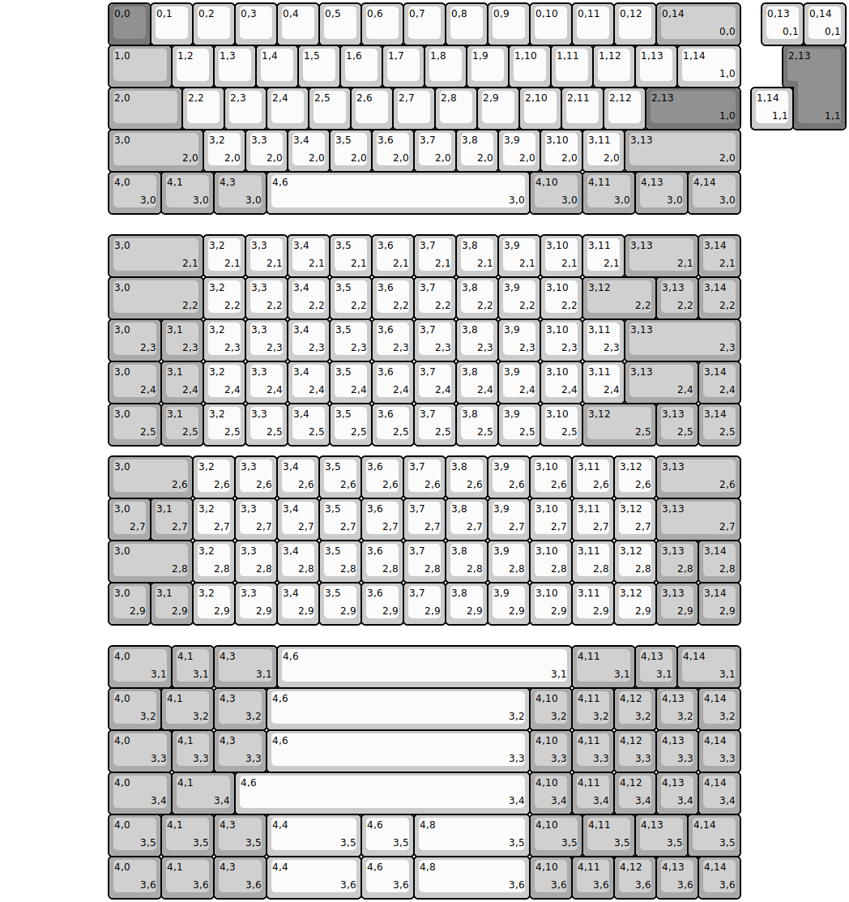
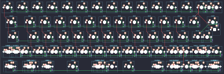

## other/dz60

[layout](dz60-kle.json) - [PCB](dz60.kicad_pcb)

{:loading="lazy"}

[Open in keyboard-layout-editor](http://www.keyboard-layout-editor.com/##@@_x:2.5&c=#777777;&=0,0&_c=#cccccc;&=0,1&=0,2&=0,3&=0,4&=0,5&=0,6&=0,7&=0,8&=0,9&=0,10&=0,11&=0,12&_c=#aaaaaa&w:2;&=0,14%0A%0A%0A0,0;&@_x:2.5&w:1.5;&=1,0&_c=#cccccc;&=1,2&=1,3&=1,4&=1,5&=1,6&=1,7&=1,8&=1,9&=1,10&=1,11&=1,12&=1,13&_w:1.5;&=1,14%0A%0A%0A1,0;&@_x:2.5&c=#aaaaaa&w:1.75;&=2,0&_c=#cccccc;&=2,2&=2,3&=2,4&=2,5&=2,6&=2,7&=2,8&=2,9&=2,10&=2,11&=2,12&_c=#777777&w:2.25;&=2,13%0A%0A%0A1,0;&@_x:2.5&c=#aaaaaa&w:2.25;&=3,0%0A%0A%0A2,0&_c=#cccccc;&=3,2%0A%0A%0A2,0&=3,3%0A%0A%0A2,0&=3,4%0A%0A%0A2,0&=3,5%0A%0A%0A2,0&=3,6%0A%0A%0A2,0&=3,7%0A%0A%0A2,0&=3,8%0A%0A%0A2,0&=3,9%0A%0A%0A2,0&=3,10%0A%0A%0A2,0&=3,11%0A%0A%0A2,0&_c=#aaaaaa&w:2.75;&=3,13%0A%0A%0A2,0;&@_x:2.5&w:1.25;&=4,0%0A%0A%0A3,0&_w:1.25;&=4,1%0A%0A%0A3,0&_w:1.25;&=4,3%0A%0A%0A3,0&_c=#cccccc&w:6.25;&=4,6%0A%0A%0A3,0&_c=#aaaaaa&w:1.25;&=4,10%0A%0A%0A3,0&_w:1.25;&=4,11%0A%0A%0A3,0&_w:1.25;&=4,13%0A%0A%0A3,0&_w:1.25;&=4,14%0A%0A%0A3,0;&@_x:18.0&y:-5&c=#cccccc;&=0,13%0A%0A%0A0,1&=0,14%0A%0A%0A0,1;&@_x:18.75&c=#777777&w:1.25&h:2&w2:1.5&h2:1&x2:-0.25;&=2,13%0A%0A%0A1,1;&@_x:17.75&c=#cccccc;&=1,14%0A%0A%0A1,1;&@_x:2.5&y:2.5&c=#aaaaaa&w:2.25;&=3,0%0A%0A%0A2,1&_c=#cccccc;&=3,2%0A%0A%0A2,1&=3,3%0A%0A%0A2,1&=3,4%0A%0A%0A2,1&=3,5%0A%0A%0A2,1&=3,6%0A%0A%0A2,1&=3,7%0A%0A%0A2,1&=3,8%0A%0A%0A2,1&=3,9%0A%0A%0A2,1&=3,10%0A%0A%0A2,1&=3,11%0A%0A%0A2,1&_c=#aaaaaa&w:1.75;&=3,13%0A%0A%0A2,1&=3,14%0A%0A%0A2,1;&@_x:2.5&w:2.25;&=3,0%0A%0A%0A2,2&_c=#cccccc;&=3,2%0A%0A%0A2,2&=3,3%0A%0A%0A2,2&=3,4%0A%0A%0A2,2&=3,5%0A%0A%0A2,2&=3,6%0A%0A%0A2,2&=3,7%0A%0A%0A2,2&=3,8%0A%0A%0A2,2&=3,9%0A%0A%0A2,2&=3,10%0A%0A%0A2,2;&@_x:2.5&c=#aaaaaa&w:1.25;&=3,0%0A%0A%0A2,3&=3,1%0A%0A%0A2,3&_c=#cccccc;&=3,2%0A%0A%0A2,3&=3,3%0A%0A%0A2,3&=3,4%0A%0A%0A2,3&=3,5%0A%0A%0A2,3&=3,6%0A%0A%0A2,3&=3,7%0A%0A%0A2,3&=3,8%0A%0A%0A2,3&=3,9%0A%0A%0A2,3&=3,10%0A%0A%0A2,3&=3,11%0A%0A%0A2,3&_c=#aaaaaa&w:2.75;&=3,13%0A%0A%0A2,3;&@_x:2.5&w:1.25;&=3,0%0A%0A%0A2,4&=3,1%0A%0A%0A2,4&_c=#cccccc;&=3,2%0A%0A%0A2,4&=3,3%0A%0A%0A2,4&=3,4%0A%0A%0A2,4&=3,5%0A%0A%0A2,4&=3,6%0A%0A%0A2,4&=3,7%0A%0A%0A2,4&=3,8%0A%0A%0A2,4&=3,9%0A%0A%0A2,4&=3,10%0A%0A%0A2,4&=3,11%0A%0A%0A2,4&_c=#aaaaaa&w:1.75;&=3,13%0A%0A%0A2,4&=3,14%0A%0A%0A2,4;&@_x:2.5&w:1.25;&=3,0%0A%0A%0A2,5&=3,1%0A%0A%0A2,5&_c=#cccccc;&=3,2%0A%0A%0A2,5&=3,3%0A%0A%0A2,5&=3,4%0A%0A%0A2,5&=3,5%0A%0A%0A2,5&=3,6%0A%0A%0A2,5&=3,7%0A%0A%0A2,5&=3,8%0A%0A%0A2,5&=3,9%0A%0A%0A2,5&=3,10%0A%0A%0A2,5;&@_x:2.5&y:0.25&c=#aaaaaa&w:2;&=3,0%0A%0A%0A2,6&_c=#cccccc;&=3,2%0A%0A%0A2,6&=3,3%0A%0A%0A2,6&=3,4%0A%0A%0A2,6&=3,5%0A%0A%0A2,6&=3,6%0A%0A%0A2,6&=3,7%0A%0A%0A2,6&=3,8%0A%0A%0A2,6&=3,9%0A%0A%0A2,6&=3,10%0A%0A%0A2,6&=3,11%0A%0A%0A2,6&=3,12%0A%0A%0A2,6&_c=#aaaaaa&w:2;&=3,13%0A%0A%0A2,6;&@_x:2.5;&=3,0%0A%0A%0A2,7&=3,1%0A%0A%0A2,7&_c=#cccccc;&=3,2%0A%0A%0A2,7&=3,3%0A%0A%0A2,7&=3,4%0A%0A%0A2,7&=3,5%0A%0A%0A2,7&=3,6%0A%0A%0A2,7&=3,7%0A%0A%0A2,7&=3,8%0A%0A%0A2,7&=3,9%0A%0A%0A2,7&=3,10%0A%0A%0A2,7&=3,11%0A%0A%0A2,7&=3,12%0A%0A%0A2,7&_c=#aaaaaa&w:2;&=3,13%0A%0A%0A2,7;&@_x:2.5&w:2;&=3,0%0A%0A%0A2,8&_c=#cccccc;&=3,2%0A%0A%0A2,8&=3,3%0A%0A%0A2,8&=3,4%0A%0A%0A2,8&=3,5%0A%0A%0A2,8&=3,6%0A%0A%0A2,8&=3,7%0A%0A%0A2,8&=3,8%0A%0A%0A2,8&=3,9%0A%0A%0A2,8&=3,10%0A%0A%0A2,8&=3,11%0A%0A%0A2,8&=3,12%0A%0A%0A2,8&_c=#aaaaaa;&=3,13%0A%0A%0A2,8&=3,14%0A%0A%0A2,8;&@_x:2.5;&=3,0%0A%0A%0A2,9&=3,1%0A%0A%0A2,9&_c=#cccccc;&=3,2%0A%0A%0A2,9&=3,3%0A%0A%0A2,9&=3,4%0A%0A%0A2,9&=3,5%0A%0A%0A2,9&=3,6%0A%0A%0A2,9&=3,7%0A%0A%0A2,9&=3,8%0A%0A%0A2,9&=3,9%0A%0A%0A2,9&=3,10%0A%0A%0A2,9&=3,11%0A%0A%0A2,9&=3,12%0A%0A%0A2,9&_c=#aaaaaa;&=3,13%0A%0A%0A2,9&=3,14%0A%0A%0A2,9;&@_x:2.5&y:0.5&w:1.5;&=4,0%0A%0A%0A3,1&=4,1%0A%0A%0A3,1&_w:1.5;&=4,3%0A%0A%0A3,1&_c=#cccccc&w:7;&=4,6%0A%0A%0A3,1&_c=#aaaaaa&w:1.5;&=4,11%0A%0A%0A3,1&=4,13%0A%0A%0A3,1&_w:1.5;&=4,14%0A%0A%0A3,1;&@_x:2.5&w:1.25;&=4,0%0A%0A%0A3,2&_w:1.25;&=4,1%0A%0A%0A3,2&_w:1.25;&=4,3%0A%0A%0A3,2&_c=#cccccc&w:6.25;&=4,6%0A%0A%0A3,2&_c=#aaaaaa;&=4,10%0A%0A%0A3,2&=4,11%0A%0A%0A3,2&=4,12%0A%0A%0A3,2&=4,13%0A%0A%0A3,2&=4,14%0A%0A%0A3,2;&@_x:2.5&w:1.5;&=4,0%0A%0A%0A3,3&=4,1%0A%0A%0A3,3&_w:1.25;&=4,3%0A%0A%0A3,3&_c=#cccccc&w:6.25;&=4,6%0A%0A%0A3,3&_c=#aaaaaa;&=4,10%0A%0A%0A3,3&=4,11%0A%0A%0A3,3&=4,12%0A%0A%0A3,3&=4,13%0A%0A%0A3,3&=4,14%0A%0A%0A3,3;&@_x:2.5&w:1.5;&=4,0%0A%0A%0A3,4&_w:1.5;&=4,1%0A%0A%0A3,4&_c=#cccccc&w:7;&=4,6%0A%0A%0A3,4&_c=#aaaaaa;&=4,10%0A%0A%0A3,4&=4,11%0A%0A%0A3,4&=4,12%0A%0A%0A3,4&=4,13%0A%0A%0A3,4&=4,14%0A%0A%0A3,4;&@_x:2.5&w:1.25;&=4,0%0A%0A%0A3,5&_w:1.25;&=4,1%0A%0A%0A3,5&_w:1.25;&=4,3%0A%0A%0A3,5&_c=#cccccc&w:2.25;&=4,4%0A%0A%0A3,5&_w:1.25;&=4,6%0A%0A%0A3,5&_w:2.75;&=4,8%0A%0A%0A3,5&_c=#aaaaaa&w:1.25;&=4,10%0A%0A%0A3,5&_w:1.25;&=4,11%0A%0A%0A3,5&_w:1.25;&=4,13%0A%0A%0A3,5&_w:1.25;&=4,14%0A%0A%0A3,5;&@_x:2.5&w:1.25;&=4,0%0A%0A%0A3,6&_w:1.25;&=4,1%0A%0A%0A3,6&_w:1.25;&=4,3%0A%0A%0A3,6&_c=#cccccc&w:2.25;&=4,4%0A%0A%0A3,6&_w:1.25;&=4,6%0A%0A%0A3,6&_w:2.75;&=4,8%0A%0A%0A3,6&_c=#aaaaaa;&=4,10%0A%0A%0A3,6&=4,11%0A%0A%0A3,6&=4,12%0A%0A%0A3,6&=4,13%0A%0A%0A3,6&=4,14%0A%0A%0A3,6;&@_rx:0.25&x:13.5&y:6.5&w:1.75;&=3,12%0A%0A%0A2,2&=3,13%0A%0A%0A2,2&=3,14%0A%0A%0A2,2;&@_x:13.5&y:2.0&w:1.75;&=3,12%0A%0A%0A2,5&=3,13%0A%0A%0A2,5&=3,14%0A%0A%0A2,5)

{:loading="lazy"}

