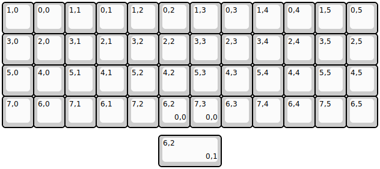

## other/efreet

[layout](efreet-kle.json) - [PCB](efreet.kicad_pcb)

{:loading="lazy"}

[Open in keyboard-layout-editor](http://www.keyboard-layout-editor.com/##@@=1,0&=0,0&=1,1&=0,1&=1,2&=0,2&=1,3&=0,3&=1,4&=0,4&=1,5&=0,5;&@=3,0&=2,0&=3,1&=2,1&=3,2&=2,2&=3,3&=2,3&=3,4&=2,4&=3,5&=2,5;&@=5,0&=4,0&=5,1&=4,1&=5,2&=4,2&=5,3&=4,3&=5,4&=4,4&=5,5&=4,5;&@=7,0&=6,0&=7,1&=6,1&=7,2&=6,2%0A%0A%0A0,0&=7,3%0A%0A%0A0,0&=6,3&=7,4&=6,4&=7,5&=6,5;&@_x:5&y:0.25&w:2;&=6,2%0A%0A%0A0,1)

{:loading="lazy"}

