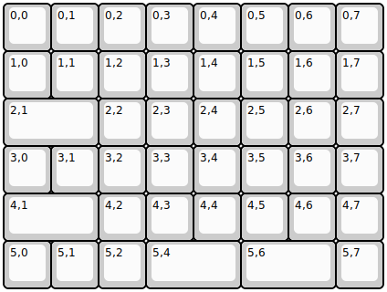
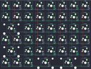

## other/halfkey

[layout](halfkey-kle.json) - [PCB](halfkey.kicad_pcb)

{:loading="lazy"}

[Open in keyboard-layout-editor](http://www.keyboard-layout-editor.com/##@@=0,0&=0,1&=0,2&=0,3&=0,4&=0,5&=0,6&=0,7;&@=1,0&=1,1&=1,2&=1,3&=1,4&=1,5&=1,6&=1,7;&@_w:2;&=2,1&=2,2&=2,3&=2,4&=2,5&=2,6&=2,7;&@=3,0&=3,1&=3,2&=3,3&=3,4&=3,5&=3,6&=3,7;&@_w:2;&=4,1&=4,2&=4,3&=4,4&=4,5&=4,6&=4,7;&@=5,0&=5,1&=5,2&_w:2;&=5,4&_w:2;&=5,6&=5,7)

{:loading="lazy"}

