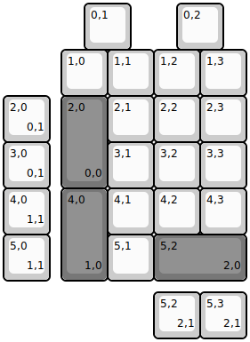
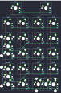

## other/hub20

[layout](hub20-kle.json) - [PCB](hub20.kicad_pcb)

{:loading="lazy"}

[Open in keyboard-layout-editor](http://www.keyboard-layout-editor.com/##@@_x:1.75;&=0,1&_x:1.0;&=0,2;&@_x:1.25;&=1,0&=1,1&=1,2&=1,3;&@_x:1.25&c=#777777&h:2;&=2,0%0A%0A%0A0,0&_c=#cccccc;&=2,1&=2,2&=2,3;&@_x:2.25;&=3,1&=3,2&=3,3;&@_x:1.25&c=#777777&h:2;&=4,0%0A%0A%0A1,0&_c=#cccccc;&=4,1&=4,2&=4,3;&@_x:2.25;&=5,1&_c=#777777&w:2;&=5,2%0A%0A%0A2,0;&@_y:-4&c=#cccccc;&=2,0%0A%0A%0A0,1;&@=3,0%0A%0A%0A0,1;&@=4,0%0A%0A%0A1,1;&@=5,0%0A%0A%0A1,1;&@_x:3.25&y:0.25;&=5,2%0A%0A%0A2,1&=5,3%0A%0A%0A2,1)

{:loading="lazy"}

