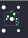

## other/is0

[layout](is0-kle.json) - [PCB](is0.kicad_pcb)

{:loading="lazy"}

[Open in keyboard-layout-editor](http://www.keyboard-layout-editor.com/##@@_w:1.25&h:2&w2:1.5&h2:1&x2:-0.25;&=0,0)

{:loading="lazy"}

