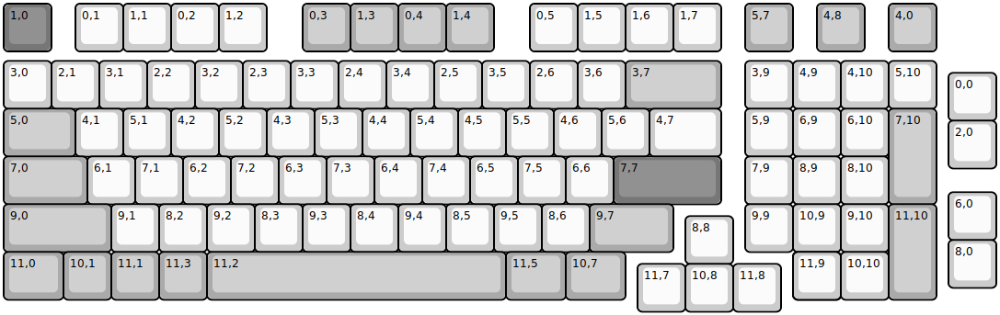
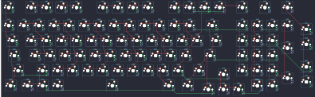

## other/kabedon/kabedon98e

[layout](kabedon98e-kle.json) - [PCB](kabedon98e.kicad_pcb)

{:loading="lazy"}

[Open in keyboard-layout-editor](http://www.keyboard-layout-editor.com/##@@_c=#777777;&=1,0&_x:0.5&c=#cccccc;&=0,1&=1,1&=0,2&=1,2&_x:0.75&c=#aaaaaa;&=0,3&=1,3&=0,4&=1,4&_x:0.75&c=#cccccc;&=0,5&=1,5&=1,6&=1,7&_x:0.5&c=#aaaaaa;&=5,7&_x:0.5;&=4,8&_x:0.5;&=4,0;&@_y:0.2&c=#cccccc;&=3,0&=2,1&=3,1&=2,2&=3,2&=2,3&=3,3&=2,4&=3,4&=2,5&=3,5&=2,6&=3,6&_c=#aaaaaa&w:2;&=3,7&_x:0.5&c=#cccccc;&=3,9&=4,9&=4,10&=5,10;&@_x:19.75&y:-0.75;&=0,0;&@_y:-0.25&c=#aaaaaa&w:1.5;&=5,0&_c=#cccccc;&=4,1&=5,1&=4,2&=5,2&=4,3&=5,3&=4,4&=5,4&=4,5&=5,5&=4,6&=5,6&_w:1.5;&=4,7&_x:0.5;&=5,9&=6,9&=6,10&_c=#aaaaaa&h:2;&=7,10;&@_x:19.75&y:-0.75&c=#cccccc;&=2,0;&@_y:-0.25&c=#aaaaaa&w:1.75;&=7,0&_c=#cccccc;&=6,1&=7,1&=6,2&=7,2&=6,3&=7,3&=6,4&=7,4&=6,5&=7,5&=6,6&_c=#777777&w:2.25;&=7,7&_x:0.5&c=#cccccc;&=7,9&=8,9&=8,10;&@_x:19.75&y:-0.25;&=6,0;&@_y:-0.75&c=#aaaaaa&w:2.25;&=9,0&_c=#cccccc;&=9,1&=8,2&=9,2&=8,3&=9,3&=8,4&=9,4&=8,5&=9,5&=8,6&_c=#aaaaaa&w:1.75;&=9,7&_x:1.5&c=#cccccc;&=9,9&=10,9&=9,10&_c=#aaaaaa&h:2;&=11,10;&@_x:14.25&y:-0.75&c=#cccccc;&=8,8;&@_x:19.75&y:-0.5;&=8,0;&@_y:-0.75&c=#aaaaaa&w:1.25;&=11,0&=10,1&=11,1&=11,3&_w:6.25;&=11,2&_w:1.25;&=11,5&_w:1.25;&=10,7&_x:3.5&c=#cccccc;&=10,9&_x:-1.0;&=11,9&=10,10;&@_x:13.25&y:-0.75;&=11,7&=10,8&=11,8)

{:loading="lazy"}

