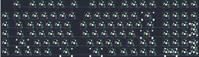

## other/kabedon/kd78s/kabedon78s

[layout](kabedon78s-kle.json) - [PCB](kabedon78s.kicad_pcb)

{:loading="lazy"}

[Open in keyboard-layout-editor](http://www.keyboard-layout-editor.com/##@@_x:2.25&y:1&c=#777777;&=0,0%0A%0A%0A0,0&_x:0.75&c=#cccccc;&=0,1%0A%0A%0A0,0&=0,2%0A%0A%0A0,0&=0,3%0A%0A%0A0,0&=0,4%0A%0A%0A0,0&_x:0.5&c=#aaaaaa;&=0,5%0A%0A%0A0,0&_x:1.0;&=0,7%0A%0A%0A0,0&=0,8%0A%0A%0A0,0&=0,9%0A%0A%0A0,0&_x:0.5&c=#cccccc;&=0,10%0A%0A%0A0,0&=0,11%0A%0A%0A0,0&=0,12%0A%0A%0A0,0&=0,13%0A%0A%0A0,0&_x:0.5&c=#aaaaaa;&=0,14%0A%0A%0A2,0&=0,15%0A%0A%0A2,0&=0,16%0A%0A%0A2,0&=0,17%0A%0A%0A2,0;&@_x:1&y:0.25&c=#cccccc;&=1,6%0A%0A%0A1,0&_x:0.25;&=1,0&=1,1&=1,2&=1,3&=1,4&=1,5&=5,5&_x:0.75;&=1,7&=1,8&=1,9&=1,10&=1,11&=1,12&_c=#777777&w:2;&=1,13&_x:0.5;&=1,14&_c=#aaaaaa;&=1,15&=1,16&=1,17;&@_x:1&c=#cccccc;&=2,6%0A%0A%0A1,0&_x:0.25&c=#aaaaaa&w:1.5;&=2,0&_c=#cccccc;&=2,1&=2,2&=2,3&=2,4&=2,5&_x:0.75;&=5,7&=2,7&=2,8&=2,9&=2,10&=2,11&=2,12&_w:1.5;&=2,13&_x:0.5;&=2,14&=2,15&=2,16&_c=#aaaaaa&h:2;&=2,17%0A%0A%0A3,0;&@_x:1&c=#cccccc;&=3,6%0A%0A%0A1,0&_x:0.25&c=#aaaaaa&w:1.75;&=3,0&_c=#cccccc;&=3,1&=3,2&=3,3&=3,4&=3,5&_x:0.75;&=3,7&=3,8&=3,9&=3,10&=3,11&=3,12&_c=#777777&w:2.25;&=3,13&_x:0.5&c=#cccccc;&=3,14&=3,15&=3,16;&@_x:1;&=4,6%0A%0A%0A1,0&_x:0.25&c=#aaaaaa&w:2.25;&=4,0&_c=#cccccc;&=4,1&=4,2&=4,3&=4,4&=4,5&_x:0.75;&=4,7&=4,8&=4,9&=4,10&_w:1.75;&=4,11&_c=#777777;&=4,12&_c=#cccccc;&=4,13&_x:0.5;&=4,14&=4,15&=4,16&_c=#aaaaaa&h:2;&=4,17%0A%0A%0A4,0;&@_x:1&c=#cccccc;&=5,6%0A%0A%0A1,0&_x:0.25&c=#aaaaaa&w:1.25;&=5,0&=5,1&=5,2&_w:1.25;&=5,3&_c=#777777&w:2.75;&=5,4&_x:0.75&w:2.25;&=5,8&_c=#aaaaaa&w:1.25;&=5,9&_w:1.25;&=5,10&_c=#777777;&=5,11&=5,12&=5,13&_x:0.5&c=#cccccc&w:2;&=5,14%0A%0A%0A5,0&=5,16;&@_x:2.25&y:-7.25&d:true;&=0,0%0A%0A%0A0,1&_x:0.75&d:true;&=0,1%0A%0A%0A0,1&_d:true;&=0,2%0A%0A%0A0,1&_d:true;&=0,3%0A%0A%0A0,1&_d:true;&=0,4%0A%0A%0A0,1&_x:0.5&d:true;&=0,5%0A%0A%0A0,1&_x:1.0&d:true;&=0,7%0A%0A%0A0,1&_d:true;&=0,8%0A%0A%0A0,1&_d:true;&=0,9%0A%0A%0A0,1&_x:0.5&d:true;&=0,10%0A%0A%0A0,1&_d:true;&=0,11%0A%0A%0A0,1&_d:true;&=0,12%0A%0A%0A0,1&_d:true;&=0,13%0A%0A%0A0,1&_x:0.5&d:true;&=0,14%0A%0A%0A2,1&_d:true;&=0,15%0A%0A%0A2,1&_d:true;&=0,16%0A%0A%0A2,1&_d:true;&=0,17%0A%0A%0A2,1;&@_y:1.25&d:true;&=1,6%0A%0A%0A1,1;&@_d:true;&=2,6%0A%0A%0A1,1&_x:22.0&c=#aaaaaa;&=2,17%0A%0A%0A3,1;&@_c=#cccccc&d:true;&=3,6%0A%0A%0A1,1&_x:22.0&c=#aaaaaa;&=3,17%0A%0A%0A3,1;&@_c=#cccccc&d:true;&=4,6%0A%0A%0A1,1&_x:22.0&c=#aaaaaa;&=4,17%0A%0A%0A4,1;&@_c=#cccccc&d:true;&=5,6%0A%0A%0A1,1&_x:22.0&c=#aaaaaa;&=5,17%0A%0A%0A4,1;&@_x:18.5&y:0.25&c=#cccccc;&=5,14%0A%0A%0A5,1&=5,15%0A%0A%0A5,1)

{:loading="lazy"}

