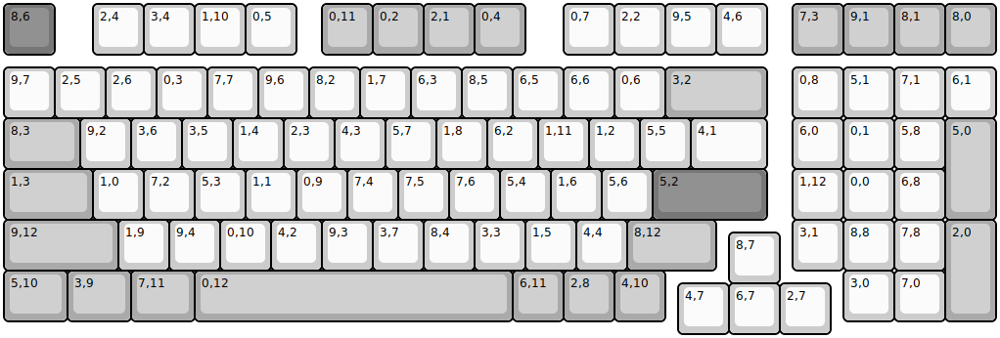
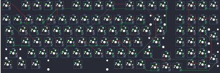

## other/kabedon/kd98/kabedon980

[layout](kabedon980-kle.json) - [PCB](kabedon980.kicad_pcb)

{:loading="lazy"}

[Open in keyboard-layout-editor](http://www.keyboard-layout-editor.com/##@@_c=#777777;&=8,6&_x:0.75&c=#cccccc;&=2,4&=3,4&=1,10&=0,5&_x:0.5&c=#aaaaaa;&=0,11&=0,2&=2,1&=0,4&_x:0.75&c=#cccccc;&=0,7&=2,2&=9,5&=4,6&_x:0.5&c=#aaaaaa;&=7,3&=9,1&=8,1&=8,0;&@_y:0.25&c=#cccccc;&=9,7&=2,5&=2,6&=0,3&=7,7&=9,6&=8,2&=1,7&=6,3&=8,5&=6,5&=6,6&=0,6&_c=#aaaaaa&w:2;&=3,2&_x:0.5&c=#cccccc;&=0,8&=5,1&=7,1&=6,1;&@_c=#aaaaaa&w:1.5;&=8,3&_c=#cccccc;&=9,2&=3,6&=3,5&=1,4&=2,3&=4,3&=5,7&=1,8&=6,2&=1,11&=1,2&=5,5&_w:1.5;&=4,1&_x:0.5;&=6,0&=0,1&=5,8&_c=#aaaaaa&h:2;&=5,0;&@_w:1.75;&=1,3&_c=#cccccc;&=1,0&=7,2&=5,3&=1,1&=0,9&=7,4&=7,5&=7,6&=5,4&=1,6&=5,6&_c=#777777&w:2.25;&=5,2&_x:0.5&c=#cccccc;&=1,12&=0,0&=6,8;&@_c=#aaaaaa&w:2.25;&=9,12&_c=#cccccc;&=1,9&=9,4&=0,10&=4,2&=9,3&=3,7&=8,4&=3,3&=1,5&=4,4&_c=#aaaaaa&w:1.75;&=8,12&_x:1.5&c=#cccccc;&=3,1&=8,8&=7,8&_c=#aaaaaa&h:2;&=2,0;&@_x:14.25&y:-0.75&c=#cccccc;&=8,7;&@_y:-0.25&c=#aaaaaa&w:1.25;&=5,10&_w:1.25;&=3,9&_w:1.25;&=7,11&_w:6.25;&=0,12&=6,11&=2,8&=4,10&_x:3.5&c=#cccccc;&=3,0&=7,0;&@_x:13.25&y:-0.75;&=4,7&=6,7&=2,7)

{:loading="lazy"}

