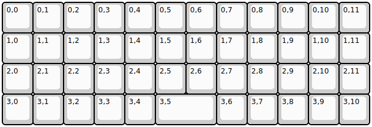
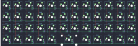

## other/latin47ble

[layout](latin47ble-kle.json) - [PCB](latin47ble.kicad_pcb)

{:loading="lazy"}

[Open in keyboard-layout-editor](http://www.keyboard-layout-editor.com/##@@=0,0&=0,1&=0,2&=0,3&=0,4&=0,5&=0,6&=0,7&=0,8&=0,9&=0,10&=0,11;&@=1,0&=1,1&=1,2&=1,3&=1,4&=1,5&=1,6&=1,7&=1,8&=1,9&=1,10&=1,11;&@=2,0&=2,1&=2,2&=2,3&=2,4&=2,5&=2,6&=2,7&=2,8&=2,9&=2,10&=2,11;&@=3,0&=3,1&=3,2&=3,3&=3,4&_w:2;&=3,5&=3,6&=3,7&=3,8&=3,9&=3,10)

{:loading="lazy"}

