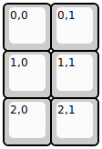
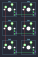

## other/pdxkbc

[layout](pdxkbc-kle.json) - [PCB](pdxkbc.kicad_pcb)

{:loading="lazy"}

[Open in keyboard-layout-editor](http://www.keyboard-layout-editor.com/##@@=0,0&=0,1;&@=1,0&=1,1;&@=2,0&=2,1)

{:loading="lazy"}

