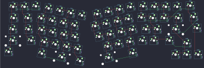

## other/ph_arisu

[layout](ph_arisu-kle.json) - [PCB](ph_arisu.kicad_pcb)

{:loading="lazy"}

[Open in keyboard-layout-editor](http://www.keyboard-layout-editor.com/##@@_x:17.3&y:0.9&c=#aaaaaa;&=2,7;&@_x:3.7&y:-0.95&c=#cccccc;&=0,1&_x:8.45;&=1,5;&@_x:1.7&y:-0.95&c=#777777;&=0,0&_c=#cccccc;&=1,0&_x:10.45;&=0,6&=1,6&=0,7;&@_x:17.6&y:-0.1&c=#aaaaaa;&=4,7;&@_x:13&y:-0.95&c=#cccccc;&=2,5;&@_x:1.5&y:-0.95&c=#aaaaaa&w:1.5;&=2,0&_c=#cccccc;&=3,0&_x:10.0;&=3,5&=2,6&_c=#aaaaaa&w:1.5;&=3,6;&@_x:17.9&y:-0.1;&=6,7;&@_x:1.3&y:-0.9&w:1.75;&=4,0&_c=#cccccc;&=5,0&_x:9.35;&=4,5&=5,5&_c=#777777&w:2.25;&=4,6;&@_x:1.05&c=#aaaaaa&w:2.25;&=6,0&_c=#cccccc;&=7,0&_x:8.8;&=7,4&=6,5&_c=#aaaaaa&w:1.75;&=7,5;&@_x:17&y:-0.75;&=7,6;&@_x:1.05&y:-0.25&w:1.5;&=8,0;&@_x:16&y:-0.75;&=8,6&=9,6&=8,7;&@_r:12&x:5.05&y:-6.25&c=#cccccc;&=1,1&=0,2&=1,2&=0,3;&@_x:4.6;&=2,1&=3,1&=2,2&=3,2;&@_x:4.85;&=4,1&=5,1&=4,2&=5,2;&@_x:5.3;&=6,1&=7,1&=6,2&=7,2;&@_x:6.6&w:2;&=8,2&_c=#aaaaaa&w:1.25;&=9,2;&@_x:5.05&y:-0.95&w:1.5;&=8,1;&@_r:-12&x:8.45&y:-1.45&c=#cccccc;&=1,3&=0,4&=1,4&=0,5;&@_x:8.05;&=2,3&=3,3&=2,4&=3,4;&@_x:8.2;&=4,3&=5,3&=4,4&=5,4;&@_x:8.75;&=6,3&=7,3&=6,4;&@_x:7.75&w:2.75;&=9,3;&@_x:10.55&y:-0.95&c=#aaaaaa&w:1.5;&=9,4)

{:loading="lazy"}

