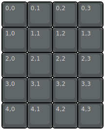
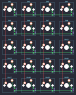

## other/snagpad

[layout](snagpad-kle.json) - [PCB](snagpad.kicad_pcb)

{:loading="lazy"}

[Open in keyboard-layout-editor](http://www.keyboard-layout-editor.com/##@@_c=#505557&t=#d9d7d7;&=0,0&=0,1&=0,2&=0,3;&@=1,0&=1,1&=1,2&=1,3;&@=2,0&=2,1&=2,2&=2,3;&@=3,0&=3,1&=3,2&=3,3;&@=4,0&=4,1&=4,2&=4,3)

{:loading="lazy"}

