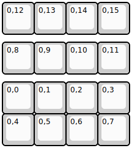
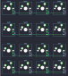

## owl8/owl8

[layout](owl8-kle.json) - [PCB](owl8.kicad_pcb)

{:loading="lazy"}

[Open in keyboard-layout-editor](http://www.keyboard-layout-editor.com/##@@=0,12&=0,13&=0,14&=0,15;&@_y:0.25;&=0,8&=0,9&=0,10&=0,11;&@_y:0.25;&=0,0&=0,1&=0,2&=0,3;&@=0,4&=0,5&=0,6&=0,7)

{:loading="lazy"}

