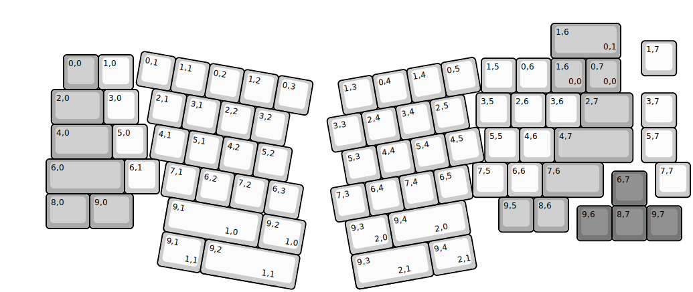
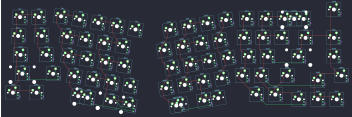

## p3dstore/glitch

[layout](glitch-kle.json) - [PCB](glitch.kicad_pcb)

{:loading="lazy"}

[Open in keyboard-layout-editor](http://www.keyboard-layout-editor.com/##@@_x:18.35&y:1.1;&=1,7;&@_x:1.75&y:-0.6&c=#aaaaaa;&=0,0&_c=#cccccc;&=1,0;&@_x:13.75&y:-0.9;&=1,5&=0,6&_c=#aaaaaa;&=1,6%0A%0A%0A0,0&=0,7%0A%0A%0A0,0;&@_x:1.4&y:-0.1&w:1.5;&=2,0&_c=#cccccc;&=3,0;&@_x:13.6&y:-0.9;&=3,5&=2,6&=3,6&_c=#aaaaaa&w:1.5;&=2,7&_x:0.25&c=#cccccc;&=3,7;&@_x:1.4&y:-0.1&c=#aaaaaa&w:1.75;&=4,0&_c=#cccccc;&=5,0;&@_x:13.85&y:-0.9;&=5,5&=4,6&_c=#aaaaaa&w:2.25;&=4,7&_x:0.25&c=#cccccc;&=5,7;&@_x:1.25&y:-0.1&c=#aaaaaa&w:2.25;&=6,0&_c=#cccccc;&=6,1;&@_x:13.5&y:-0.9;&=7,5&=6,6&_c=#aaaaaa&w:1.75;&=7,6&_x:1.5&c=#cccccc;&=7,7;&@_x:17.5&y:-0.75&c=#777777;&=6,7;&@_x:1.25&y:-0.35&c=#aaaaaa&w:1.25;&=8,0&_w:1.25;&=9,0;&@_x:14.25&y:-0.9;&=9,5&=8,6;&@_x:16.5&y:-0.75&c=#777777;&=9,6&=8,7&=9,7;&@_r:10&rx:3&ry:4.25&x:0.5&y:-3.0&c=#cccccc;&=0,1&=1,1&=0,2&=1,2&=0,3;&@_x:1;&=2,1&=3,1&=2,2&=3,2;&@_x:1.25;&=4,1&=5,1&=4,2&=5,2;&@_x:1.75;&=7,1&=6,2&=7,2&=6,3;&@_x:2&w:2.25&w2:2.75&n:true;&=9,1%0A%0A%0A1,0&_x:0.5&w:1.25;&=9,2%0A%0A%0A1,0;&@_r:-10&rx:12.5&x:-2.5&y:-2.45;&=1,3&=0,4&=1,4&=0,5;&@_x:-3.0;&=3,3&=2,4&=3,4&=2,5;&@_x:-2.75;&=5,3&=4,4&=5,4&=4,5;&@_x:-3.25;&=7,3&=6,4&=7,4&=6,5;&@_x:-3.0&w:1.25;&=9,3%0A%0A%0A2,0&_w:1.75&w2:2.25&n:true;&=9,4%0A%0A%0A2,0;&@_r:0&rx:0&ry:0&x:15.75&y:0.6&c=#aaaaaa&w:2;&=1,6%0A%0A%0A0,1;&@_r:10&rx:3&ry:4.25&x:2&y:2.0&c=#cccccc&w:1.25;&=9,1%0A%0A%0A1,1&_w:2.25&w2:2.75&n:true;&=9,2%0A%0A%0A1,1;&@_r:-10&rx:12.5&x:-3.0&y:2.55&w:1.75&w2:2.25&n:true;&=9,3%0A%0A%0A2,1&_x:0.5&w:1.25;&=9,4%0A%0A%0A2,1)

{:loading="lazy"}

