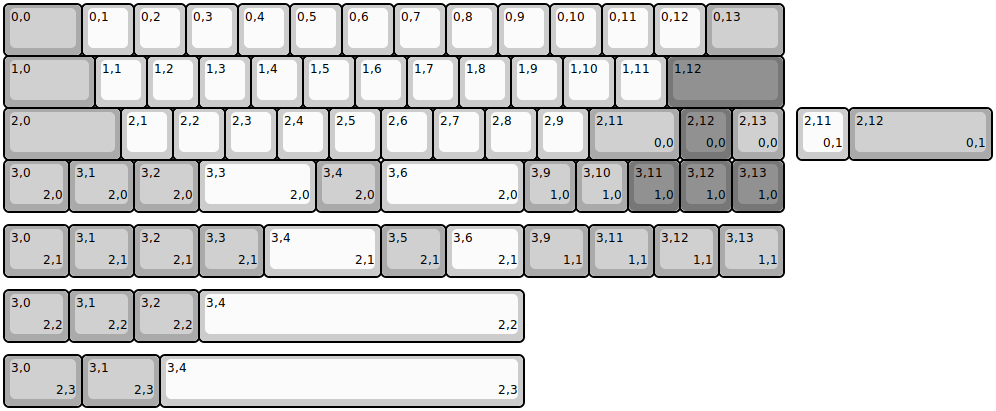
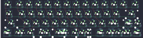

## p3dstore/tw40

[layout](tw40-kle.json) - [PCB](tw40.kicad_pcb)

{:loading="lazy"}

[Open in keyboard-layout-editor](http://www.keyboard-layout-editor.com/##@@_c=#aaaaaa&w:1.5;&=0,0&_c=#cccccc;&=0,1&=0,2&=0,3&=0,4&=0,5&=0,6&=0,7&=0,8&=0,9&=0,10&=0,11&=0,12&_c=#aaaaaa&w:1.5;&=0,13;&@_w:1.75;&=1,0&_c=#cccccc;&=1,1&=1,2&=1,3&=1,4&=1,5&=1,6&=1,7&=1,8&=1,9&=1,10&=1,11&_c=#777777&w:2.25;&=1,12;&@_c=#aaaaaa&w:2.25;&=2,0&_c=#cccccc;&=2,1&=2,2&=2,3&=2,4&=2,5&=2,6&=2,7&=2,8&=2,9&_c=#aaaaaa&w:1.75;&=2,11%0A%0A%0A0,0&_c=#777777;&=2,12%0A%0A%0A0,0&_c=#aaaaaa;&=2,13%0A%0A%0A0,0;&@_w:1.25;&=3,0%0A%0A%0A2,0&_w:1.25;&=3,1%0A%0A%0A2,0&_w:1.25;&=3,2%0A%0A%0A2,0&_c=#cccccc&w:2.25;&=3,3%0A%0A%0A2,0&_c=#aaaaaa&w:1.25;&=3,4%0A%0A%0A2,0&_c=#cccccc&w:2.75;&=3,6%0A%0A%0A2,0&_c=#aaaaaa;&=3,9%0A%0A%0A1,0&=3,10%0A%0A%0A1,0&_c=#777777;&=3,11%0A%0A%0A1,0&=3,12%0A%0A%0A1,0&=3,13%0A%0A%0A1,0;&@_x:15.25&y:-2&c=#cccccc;&=2,11%0A%0A%0A0,1&_c=#aaaaaa&w:2.75;&=2,12%0A%0A%0A0,1;&@_y:1.25&w:1.25;&=3,0%0A%0A%0A2,1&_w:1.25;&=3,1%0A%0A%0A2,1&_w:1.25;&=3,2%0A%0A%0A2,1&_w:1.25;&=3,3%0A%0A%0A2,1&_c=#cccccc&w:2.25;&=3,4%0A%0A%0A2,1&_c=#aaaaaa&w:1.25;&=3,5%0A%0A%0A2,1&_c=#cccccc&w:1.5;&=3,6%0A%0A%0A2,1&_c=#aaaaaa&w:1.25;&=3,9%0A%0A%0A1,1&_w:1.25;&=3,11%0A%0A%0A1,1&_w:1.25;&=3,12%0A%0A%0A1,1&_w:1.25;&=3,13%0A%0A%0A1,1;&@_y:0.25&w:1.25;&=3,0%0A%0A%0A2,2&_w:1.25;&=3,1%0A%0A%0A2,2&_w:1.25;&=3,2%0A%0A%0A2,2&_c=#cccccc&w:6.25;&=3,4%0A%0A%0A2,2;&@_y:0.25&c=#aaaaaa&w:1.5;&=3,0%0A%0A%0A2,3&_w:1.5;&=3,1%0A%0A%0A2,3&_c=#cccccc&w:7;&=3,4%0A%0A%0A2,3)

{:loading="lazy"}

