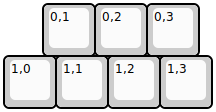
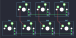

## paprikman/albacore

[layout](albacore-kle.json) - [PCB](albacore.kicad_pcb)

{:loading="lazy"}

[Open in keyboard-layout-editor](http://www.keyboard-layout-editor.com/##@@_x:0.75;&=0,1&=0,2&=0,3;&@=1,0&=1,1&=1,2&=1,3)

{:loading="lazy"}

