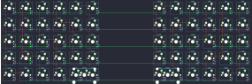

## peej/lumberjack

[layout](lumberjack-kle.json) - [PCB](lumberjack.kicad_pcb)

{:loading="lazy"}

[Open in keyboard-layout-editor](http://www.keyboard-layout-editor.com/##@@_c=#777777;&=0,0&_c=#cccccc;&=0,1&=0,2&=0,3&=0,4&=1,4&_x:3;&=1,9&=0,9&=0,8&=0,7&=0,6&_c=#aaaaaa;&=0,5;&@=1,0&_c=#cccccc;&=1,1&=1,2&=1,3&=2,3&=2,4&_x:3;&=2,9&=2,8&=1,8&=1,7&=1,6&_c=#aaaaaa;&=1,5;&@=2,0&_c=#cccccc;&=2,1&=2,2&=3,2&=3,3&=3,4&_x:3;&=3,9&=3,8&=3,7&=2,7&=2,6&_c=#aaaaaa;&=2,5;&@=3,0&_c=#cccccc;&=3,1&=4,1&=4,2&=4,3&=4,4&_x:3;&=4,9&=4,8&=4,7&=4,6&=3,6&_c=#aaaaaa;&=3,5;&@=4,0&=5,0&=5,1&=5,2&_c=#cccccc;&=5,3%0A%0A%0A0,0&=5,4%0A%0A%0A0,0&_x:3;&=5,9%0A%0A%0A0,0&=5,8%0A%0A%0A0,0&_c=#aaaaaa;&=5,7&=5,6&=5,5&=4,5&_x:-11&c=#cccccc&w:2;&=5,4%0A%0A%0A0,1&_x:3&w:2;&=5,9%0A%0A%0A0,1)

{:loading="lazy"}

