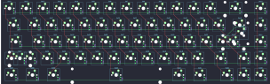

## percent/canoe

[layout](canoe-kle.json) - [PCB](canoe.kicad_pcb)

{:loading="lazy"}

[Open in keyboard-layout-editor](http://www.keyboard-layout-editor.com/##@@_x:2.5&c=#777777;&=0,13&_c=#cccccc;&=0,12&=0,11&=0,10&=0,9&=0,8&=0,7&=0,6&=0,5&=0,4&=0,3&=0,2&=0,1&_c=#aaaaaa&w:2;&=0,00&=0,14;&@_x:2.5&w:1.5;&=1,13&_c=#cccccc;&=1,12&=1,11&=1,10&=1,9&=1,8&=1,7&=1,6&=1,5&=1,4&=1,3&=1,2&=1,1&_w:1.5;&=1,0%0A%0A%0A0,0&_c=#aaaaaa;&=1,14;&@_x:2.5&w:1.75;&=2,13&_c=#cccccc;&=2,12&=2,11&=2,10&=2,9&=2,8&=2,7&=2,6&=2,5&=2,4&=2,3&=2,2&_c=#777777&w:2.25;&=2,1%0A%0A%0A0,0&_c=#aaaaaa;&=2,14;&@_x:2.5&w:2.25;&=3,13%0A%0A%0A1,0&_c=#cccccc;&=3,12&=3,11&=3,10&=3,9&=3,8&=3,7&=3,6&=3,5&=3,4&=3,3&_c=#aaaaaa&w:1.75;&=3,2&_c=#777777;&=3,0&_c=#aaaaaa;&=3,14;&@_x:2.5&w:1.25;&=4,13&_w:1.25;&=4,12&_w:1.25;&=4,11&_c=#cccccc&w:6.25;&=4,8&_c=#aaaaaa&w:1.25;&=4,4&_w:1.25;&=4,3&_x:0.5&c=#777777;&=4,2&=4,0&=4,14;&@_x:19.75&y:-4&w:1.25&h:2&w2:1.5&h2:1&x2:-0.25;&=2,1%0A%0A%0A0,1;&@_x:18.75&c=#cccccc;&=1,0%0A%0A%0A0,1;&@_c=#aaaaaa&w:1.25;&=3,13%0A%0A%0A1,1&_c=#cccccc;&=4,10%0A%0A%0A1,1)

{:loading="lazy"}

