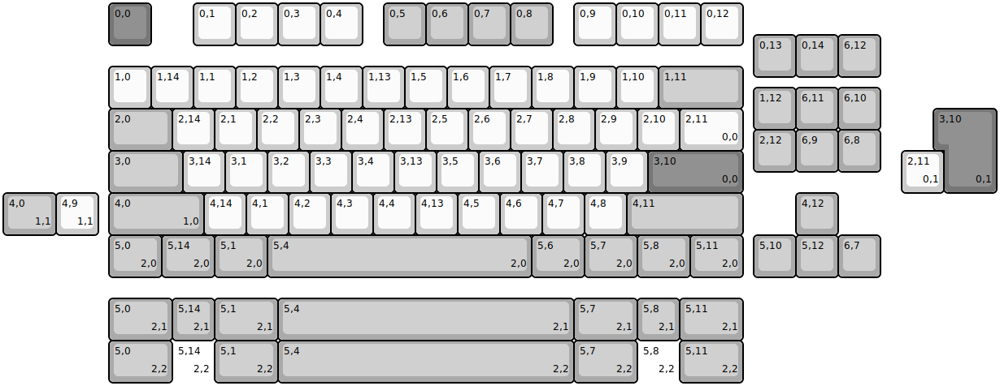
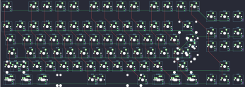

## percent/skog_lite

[layout](skog_lite-kle.json) - [PCB](skog_lite.kicad_pcb)

{:loading="lazy"}

[Open in keyboard-layout-editor](http://www.keyboard-layout-editor.com/##@@_x:2.5&c=#777777;&=0,0&_x:1.0&c=#cccccc;&=0,1&=0,2&=0,3&=0,4&_x:0.5&c=#aaaaaa;&=0,5&=0,6&=0,7&=0,8&_x:0.5&c=#cccccc;&=0,9&=0,10&=0,11&=0,12;&@_x:17.75&y:-0.25&c=#aaaaaa;&=0,13&=0,14&=6,12;&@_x:2.5&y:-0.25&c=#cccccc;&=1,0&=1,14&=1,1&=1,2&=1,3&=1,4&=1,13&=1,5&=1,6&=1,7&=1,8&=1,9&=1,10&_c=#aaaaaa&w:2;&=1,11;&@_x:17.75&y:-0.5;&=1,12&=6,11&=6,10;&@_x:2.5&y:-0.5&w:1.5;&=2,0&_c=#cccccc;&=2,14&=2,1&=2,2&=2,3&=2,4&=2,13&=2,5&=2,6&=2,7&=2,8&=2,9&=2,10&_w:1.5;&=2,11%0A%0A%0A0,0;&@_x:17.75&y:-0.5&c=#aaaaaa;&=2,12&=6,9&=6,8;&@_x:2.5&y:-0.5&w:1.75;&=3,0&_c=#cccccc;&=3,14&=3,1&=3,2&=3,3&=3,4&=3,13&=3,5&=3,6&=3,7&=3,8&=3,9&_c=#777777&w:2.25;&=3,10%0A%0A%0A0,0;&@_x:2.5&c=#aaaaaa&w:2.25;&=4,0%0A%0A%0A1,0&_c=#cccccc;&=4,14&=4,1&=4,2&=4,3&=4,4&=4,13&=4,5&=4,6&=4,7&=4,8&_c=#aaaaaa&w:2.75;&=4,11&_x:1.25;&=4,12;&@_x:2.5&w:1.25;&=5,0%0A%0A%0A2,0&_w:1.25;&=5,14%0A%0A%0A2,0&_w:1.25;&=5,1%0A%0A%0A2,0&_w:6.25;&=5,4%0A%0A%0A2,0&_w:1.25;&=5,6%0A%0A%0A2,0&_w:1.25;&=5,7%0A%0A%0A2,0&_w:1.25;&=5,8%0A%0A%0A2,0&_w:1.25;&=5,11%0A%0A%0A2,0&_x:0.25;&=5,10&=5,12&=6,7;&@_x:22.25&y:-4.0&c=#777777&w:1.25&h:2&w2:1.5&h2:1&x2:-0.25;&=3,10%0A%0A%0A0,1;&@_x:21.25&c=#cccccc;&=2,11%0A%0A%0A0,1;&@_c=#aaaaaa&w:1.25;&=4,0%0A%0A%0A1,1&_c=#cccccc;&=4,9%0A%0A%0A1,1;&@_x:2.5&y:1.5&c=#aaaaaa&w:1.5;&=5,0%0A%0A%0A2,1&=5,14%0A%0A%0A2,1&_w:1.5;&=5,1%0A%0A%0A2,1&_w:7;&=5,4%0A%0A%0A2,1&_w:1.5;&=5,7%0A%0A%0A2,1&=5,8%0A%0A%0A2,1&_w:1.5;&=5,11%0A%0A%0A2,1;&@_x:2.5&w:1.5;&=5,0%0A%0A%0A2,2&_c=#cccccc&d:true;&=5,14%0A%0A%0A2,2&_c=#aaaaaa&w:1.5;&=5,1%0A%0A%0A2,2&_w:7;&=5,4%0A%0A%0A2,2&_w:1.5;&=5,7%0A%0A%0A2,2&_c=#cccccc&d:true;&=5,8%0A%0A%0A2,2&_c=#aaaaaa&w:1.5;&=5,11%0A%0A%0A2,2)

{:loading="lazy"}

