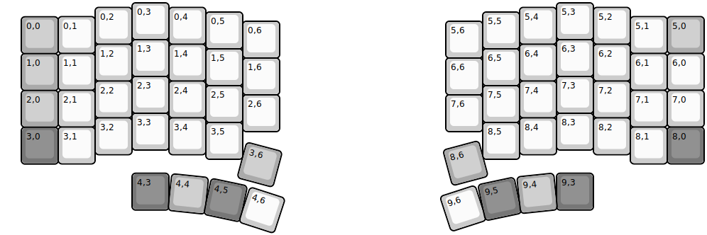
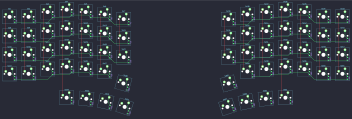

## pinky/4/pinky4

[layout](pinky4-kle.json) - [PCB](pinky4.kicad_pcb)

{:loading="lazy"}

[Open in keyboard-layout-editor](http://www.keyboard-layout-editor.com/##@@_x:3.5;&=0,3&_x:10.5;&=5,3;&@_x:2.5&y:-0.875;&=0,2&_x:1.0;&=0,4&_x:8.5;&=5,4&_x:1.0;&=5,2;&@_x:5.5&y:-0.875;&=0,5&_x:6.5;&=5,5;&@_x:1.5&y:-0.875;&=0,1&_x:14.5;&=5,1&_c=#aaaaaa;&=5,0;&@_x:0.5&y:-0.995;&=0,0;&@_x:6.5&y:-0.88&c=#cccccc;&=0,6&_x:4.5;&=5,6;&@_x:3.5&y:-0.5;&=1,3&_x:10.5;&=6,3;&@_x:2.5&y:-0.875;&=1,2&_x:1.0;&=1,4&_x:8.5;&=6,4&_x:1.0;&=6,2;&@_x:5.5&y:-0.875;&=1,5&_x:6.5;&=6,5;&@_x:1.5&y:-0.875;&=1,1&_x:14.5;&=6,1&=6,0;&@_x:0.5&y:-0.995&c=#aaaaaa;&=1,0;&@_x:6.5&y:-0.88&c=#cccccc;&=1,6&_x:4.5;&=6,6;&@_x:3.5&y:-0.5;&=2,3&_x:10.5;&=7,3;&@_x:2.5&y:-0.875;&=2,2&_x:1.0;&=2,4&_x:8.5;&=7,4&_x:1.0;&=7,2;&@_x:5.5&y:-0.875;&=2,5&_x:6.5;&=7,5;&@_x:1.5&y:-0.875;&=2,1&_x:14.5;&=7,1&=7,0;&@_x:0.5&y:-0.995&c=#aaaaaa;&=2,0;&@_x:6.5&y:-0.88&c=#cccccc;&=2,6&_x:4.5;&=7,6;&@_x:3.5&y:-0.5;&=3,3&_x:10.5;&=8,3;&@_x:2.5&y:-0.875;&=3,2&_x:1.0;&=3,4&_x:8.5;&=8,4&_x:1.0;&=8,2;&@_x:5.5&y:-0.875;&=3,5&_x:6.5;&=8,5;&@_x:1.5&y:-0.875;&=3,1&_x:14.5;&=8,1&_c=#777777;&=8,0;&@_x:0.5&y:-0.995;&=3,0;&@_x:15&y:0.25;&=9,3;&@_rx:4&ry:15&x:-0.5&y:-10.37;&=4,3;&@_r:6&x:-0.5&y:-1.0&c=#aaaaaa;&=4,4;&@_r:12&x:-0.5&y:-1.0&c=#777777;&=4,5;&@_r:15&rx:6.5&ry:4.25&y:-0.5&c=#aaaaaa;&=3,6;&@_r:18&rx:4&ry:15&x:-0.5&y:-10.37&c=#cccccc;&=4,6;&@_r:-18&rx:15.5&x:-0.5&y:-10.37;&=9,6;&@_r:-15&rx:13&ry:4.25&x:-1&y:-0.5&c=#aaaaaa;&=8,6;&@_r:-12&rx:15.5&ry:15&x:-0.5&y:-10.37&c=#777777;&=9,5;&@_r:-6&x:-0.5&y:-1.0&c=#aaaaaa;&=9,4)

{:loading="lazy"}

