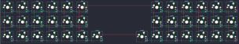

## pisces/pisces

[layout](pisces-kle.json) - [PCB](pisces.kicad_pcb)

{:loading="lazy"}

[Open in keyboard-layout-editor](http://www.keyboard-layout-editor.com/##@@_c=#777777;&=0,0&_c=#cccccc;&=0,1&=0,2&=0,3&=0,4&=0,5&_x:4;&=3,5&=3,4&=3,3&=3,2&=3,1&_c=#aaaaaa;&=3,0;&@=1,0&_c=#cccccc;&=1,1&=1,2&=1,3&=1,4&=1,5&_x:4;&=4,5&=4,4&=4,3&=4,2&=4,1&_c=#aaaaaa;&=4,0;&@=2,0&_c=#cccccc;&=2,1&=2,2&=2,3&=2,4&=2,5&_c=#aaaaaa;&=2,6&_x:2;&=5,6&_c=#cccccc;&=5,5&=5,4&=5,3&=5,2&=5,1&_c=#777777;&=5,0)

{:loading="lazy"}

