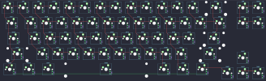

## pixlupkeyboards/blackplum

[layout](blackplum-kle.json) - [PCB](blackplum.kicad_pcb)

{:loading="lazy"}

[Open in keyboard-layout-editor](http://www.keyboard-layout-editor.com/##@@_c=#777777;&=0,0&_c=#cccccc;&=1,0&=0,1&=1,1&=0,2&=1,2&=0,3&=1,3&=0,4&=1,4&=0,5&=1,5&=0,6&_c=#aaaaaa&w:2;&=1,6&_x:0.25;&=0,7&=1,7;&@_w:1.5;&=2,0&_c=#cccccc;&=3,0&=2,1&=3,1&=2,2&=3,2&=2,3&=3,3&=2,4&=3,4&=2,5&=3,5&=2,6&_w:1.5;&=3,6&_x:0.25&c=#aaaaaa;&=2,7&=3,7;&@_w:1.75;&=4,0&_c=#cccccc;&=5,0&=4,1&=5,1&=4,2&=5,2&=4,3&=5,3&=4,4&=5,4&=4,5&=5,5&_c=#777777&w:2.25;&=4,6;&@_c=#aaaaaa&w:2.25;&=6,0&_c=#cccccc;&=7,0&=6,1&=7,1&=6,2&=7,2&=6,3&=7,3&=6,4&=7,4&=6,5&_c=#aaaaaa&w:2.75;&=7,5;&@_x:15.25&y:-0.75;&=6,6;&@_y:-0.25&w:1.25;&=8,0&_w:1.25;&=8,1&_w:1.25;&=8,2&_c=#777777&w:6.25;&=8,3&_c=#aaaaaa&w:1.25;&=8,4&_w:1.25;&=8,5&_w:1.25;&=8,6;&@_x:14.25&y:-0.75;&=7,6&=6,7&=7,7)

{:loading="lazy"}

