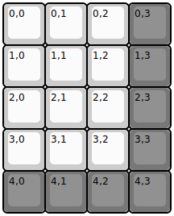
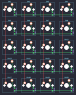

## pixlupkeyboards/tenki

[layout](tenki-kle.json) - [PCB](tenki.kicad_pcb)

{:loading="lazy"}

[Open in keyboard-layout-editor](http://www.keyboard-layout-editor.com/##@@=0,0&=0,1&=0,2&_c=#777777;&=0,3;&@_c=#cccccc;&=1,0&=1,1&=1,2&_c=#777777;&=1,3;&@_c=#cccccc;&=2,0&=2,1&=2,2&_c=#777777;&=2,3;&@_c=#cccccc;&=3,0&=3,1&=3,2&_c=#777777;&=3,3;&@=4,0&=4,1&=4,2&=4,3)

{:loading="lazy"}

