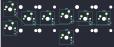

## ploopyco/mouse

[layout](mouse-kle.json) - [PCB](mouse.kicad_pcb)

{:loading="lazy"}

[Open in keyboard-layout-editor](http://www.keyboard-layout-editor.com/##@@=0,4&_h:2;&=0,6&_h:2;&=0,0&_x:1&h:2;&=0,2&_h:2;&=0,5;&@_x:3&y:-0.75&h:1.25;&=0,1;&@_y:-0.25;&=0,3;&@_x:3&y:-0.5;&=0,7)

{:loading="lazy"}

