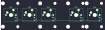
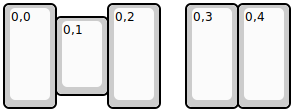
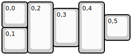
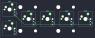

## ploopyco/trackball

[layout](trackball-kle.json) - [PCB](trackball.kicad_pcb)

{:loading="lazy"}

[Open in keyboard-layout-editor](http://www.keyboard-layout-editor.com/##@@_h:2;&=0,0&_x:1&h:2;&=0,2&_x:0.5&h:2;&=0,3&_h:2;&=0,4;&@_x:1&y:-0.75&h:1.5;&=0,1)

{:loading="lazy"}

## ploopyco/trackball/trackball_mini

[layout](trackball_mini-kle.json) - [PCB](trackball_mini.kicad_pcb)

{:loading="lazy"}

[Open in keyboard-layout-editor](http://www.keyboard-layout-editor.com/##@@_h:2;&=0,0&_x:1&h:2;&=0,2&_x:0.5&h:2;&=0,3&_h:2;&=0,4;&@_x:1&y:-0.75&h:1.5;&=0,1)

{:loading="lazy"}

## ploopyco/trackball/trackball_thumb

[layout](trackball_thumb-kle.json) - [PCB](trackball_thumb.kicad_pcb)

{:loading="lazy"}

[Open in keyboard-layout-editor](http://www.keyboard-layout-editor.com/##@@=0,0&_h:2;&=0,2&_x:1&h:2;&=0,4;&@_x:2&y:-0.75&h:1.5;&=0,3;&@_x:4&y:-0.75;&=0,5;&@_y:-0.5;&=0,1)

{:loading="lazy"}

