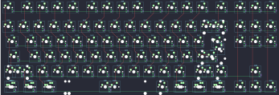
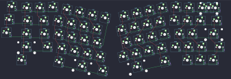
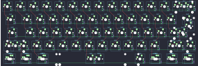
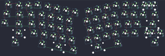

## plywrks/ahgase

[layout](ahgase-kle.json) - [PCB](ahgase.kicad_pcb)

{:loading="lazy"}

[Open in keyboard-layout-editor](http://www.keyboard-layout-editor.com/##@@_c=#777777;&=0,0&_x:0.25&c=#aaaaaa;&=0,1&=0,2&=0,3&=0,4&_x:0.25;&=0,5&=0,6&=0,7&=0,8&_x:0.25;&=0,9&=0,10&=0,11&=0,12&_x:0.25;&=0,13&_x:0.25;&=0,14&=0,15&=0,16;&@_y:0.25&c=#cccccc;&=1,0&=1,1&=1,2&=1,3&=1,4&=1,5&=1,6&=1,7&=1,8&=1,9&=1,10&=1,11&=1,12&_c=#aaaaaa&w:2;&=1,13%0A%0A%0A0,0&_x:0.25;&=1,14&=1,15&=1,16;&@_w:1.5;&=2,0&_c=#cccccc;&=2,1&=2,2&=2,3&=2,4&=2,5&=2,6&=2,7&=2,8&=2,9&=2,10&=2,11&=2,12&_w:1.5;&=2,13%0A%0A%0A1,0&_x:0.25&c=#aaaaaa;&=2,14&=2,15&=2,16;&@_w:1.75;&=3,0&_c=#cccccc;&=3,1&=3,2&=3,3&=3,4&=3,5&=3,6&=3,7&=3,8&=3,9&=3,10&=3,11&_c=#777777&w:2.25;&=3,12%0A%0A%0A1,0;&@_c=#aaaaaa&w:2.25;&=4,0%0A%0A%0A2,0&_c=#cccccc;&=4,2&=4,3&=4,4&=4,5&=4,6&=4,7&=4,8&=4,9&=4,10&=4,11&_c=#aaaaaa&w:2.75;&=4,12%0A%0A%0A3,0&_x:1.25&c=#777777;&=4,15;&@_c=#aaaaaa&w:1.25;&=5,0%0A%0A%0A4,0&_w:1.25;&=5,1%0A%0A%0A4,0&_w:1.25;&=5,2%0A%0A%0A4,0&_c=#cccccc&w:6.25;&=5,7%0A%0A%0A4,0&_c=#aaaaaa&w:1.25;&=5,10%0A%0A%0A4,0&_w:1.25;&=5,11%0A%0A%0A4,0&_w:1.25;&=5,12%0A%0A%0A4,0&_w:1.25;&=5,13%0A%0A%0A4,0&_x:0.25&c=#777777;&=5,14&=5,15&=5,16;&@_x:13&y:0.25&c=#aaaaaa;&=1,13%0A%0A%0A0,1&=3,13%0A%0A%0A0,1;&@_x:13.75&c=#777777&w:1.25&h:2&w2:1.5&h2:1&x2:-0.25;&=2,13%0A%0A%0A1,1;&@_x:12.75&c=#cccccc;&=3,12%0A%0A%0A1,1;&@_c=#aaaaaa&w:1.25;&=4,0%0A%0A%0A2,1&_c=#cccccc;&=4,1%0A%0A%0A2,1&_x:10.0&c=#aaaaaa&w:1.75;&=4,12%0A%0A%0A3,1&=4,13%0A%0A%0A3,1;&@_w:1.5;&=5,0%0A%0A%0A4,1&=5,1%0A%0A%0A4,1&_w:1.5;&=5,2%0A%0A%0A4,1&_c=#cccccc&w:7;&=5,7%0A%0A%0A4,1&_c=#aaaaaa&w:1.5;&=5,11%0A%0A%0A4,1&=5,12%0A%0A%0A4,1&_w:1.5;&=5,13%0A%0A%0A4,1;&@_w:1.5;&=5,0%0A%0A%0A4,2&_d:true;&=5,1%0A%0A%0A4,2&_w:1.5;&=5,2%0A%0A%0A4,2&_c=#cccccc&w:7;&=5,7%0A%0A%0A4,2&_c=#aaaaaa&w:1.5;&=5,11%0A%0A%0A4,2&_d:true;&=5,12%0A%0A%0A4,2&_w:1.5;&=5,13%0A%0A%0A4,2)

{:loading="lazy"}

## plywrks/allaro

[layout](allaro-kle.json) - [PCB](allaro.kicad_pcb)

{:loading="lazy"}

[Open in keyboard-layout-editor](http://www.keyboard-layout-editor.com/##@@_x:0.55&y:1.15&c=#777777;&=0,0;&@_x:3.7&y:-0.95&c=#cccccc;&=0,3&_x:8.45;&=0,11;&@_x:1.7&y:-0.95;&=0,1&=0,2&_x:10.45;&=0,12&=0,13%0A%0A%0A0,0&_c=#aaaaaa;&=0,14%0A%0A%0A0,0;&@_x:0.35&y:-0.1;&=1,0;&@_x:13&y:-0.95&c=#cccccc;&=1,11;&@_x:1.5&y:-0.95&c=#aaaaaa&w:1.5;&=1,1&_c=#cccccc;&=1,2&_x:10.0;&=1,12&=1,13&_c=#aaaaaa&w:1.5;&=1,14;&@_x:0.15&y:-0.1;&=2,0;&@_x:1.3&y:-0.9&w:1.75;&=2,1&_c=#cccccc;&=2,2&_x:9.35;&=2,12&=2,13&_c=#777777&w:2.25;&=2,14;&@_x:1.05&c=#aaaaaa&w:2.25;&=3,1&_c=#cccccc;&=3,2&_x:8.8;&=3,11&=3,12&_c=#aaaaaa;&=3,13&_w:1.75;&=3,14;&@_x:1.05&w:1.5;&=4,1&_x:11.45;&=4,12&=4,13&=4,14;&@_r:12&x:5.05&y:-6.0&c=#cccccc;&=0,4&=0,5&=0,6&=2,7;&@_x:4.6;&=1,3&=1,4&=1,5&=1,6;&@_x:4.85;&=2,3&=2,4&=2,5&=2,6;&@_x:5.3;&=3,3&=3,4&=3,5&=3,6;&@_x:6.6&c=#777777&w:2;&=4,5&_c=#aaaaaa&w:1.25;&=4,6;&@_x:5.05&y:-0.95&w:1.5;&=4,3;&@_r:-12&x:8.45&y:-1.45&c=#cccccc;&=0,7&=0,8&=0,9&=0,10;&@_x:8.05;&=1,7&=1,8&=1,9&=1,10;&@_x:8.2;&=2,8&=2,9&=2,10&=2,11;&@_x:7.75;&=3,7&=3,8&=3,9&=3,10;&@_x:7.75&c=#777777&w:2.75;&=4,8;&@_x:10.55&y:-0.95&c=#aaaaaa&w:1.5;&=4,10;&@_r:0&x:15.15&y:-8.75&w:2;&=0,14%0A%0A%0A0,1)

{:loading="lazy"}

## plywrks/ji_eun

[layout](ji_eun-kle.json) - [PCB](ji_eun.kicad_pcb)

{:loading="lazy"}

[Open in keyboard-layout-editor](http://www.keyboard-layout-editor.com/##@@_c=#777777;&=0,0&_c=#cccccc;&=0,1&=0,2&=0,3&=0,4&=0,5&=0,6&=0,7&=0,8&=0,9&=0,10&=0,11&=0,12&_c=#aaaaaa&w:2;&=0,13%0A%0A%0A0,0;&@_w:1.5;&=1,0&_c=#cccccc;&=1,1&=1,2&=1,3&=1,4&=1,5&=1,6&=1,7&=1,8&=1,9&=1,10&=1,11&=1,12&_c=#aaaaaa&w:1.5;&=1,14%0A%0A%0A1,0;&@_w:1.75;&=2,0&_c=#cccccc;&=2,1&=2,2&=2,3&=2,4&=2,5&=2,6&=2,7&=2,8&=2,9&=2,10&=2,11&_c=#777777&w:2.25;&=2,13%0A%0A%0A1,0;&@_c=#aaaaaa&w:2.25;&=3,0%0A%0A%0A2,0&_c=#cccccc;&=3,2&=3,3&=3,4&=3,5&=3,6&=3,7&=3,8&=3,9&=3,10&=3,11&_c=#aaaaaa&w:2.75;&=3,13%0A%0A%0A3,0;&@_w:1.25;&=4,0%0A%0A%0A4,0&_w:1.25;&=4,1%0A%0A%0A4,0&_w:1.25;&=4,2%0A%0A%0A4,0&_c=#cccccc&w:6.25;&=4,6%0A%0A%0A4,0&_c=#aaaaaa&w:1.25;&=4,10%0A%0A%0A4,0&_w:1.25;&=4,11%0A%0A%0A4,0&_w:1.25;&=4,13%0A%0A%0A4,0&_w:1.25;&=4,14%0A%0A%0A4,0;&@_x:15.5&y:-5&c=#cccccc;&=0,13%0A%0A%0A0,1&_c=#aaaaaa;&=0,14%0A%0A%0A0,1;&@_x:16.25&c=#777777&w:1.25&h:2&w2:1.5&h2:1&x2:-0.25;&=2,13%0A%0A%0A1,1;&@_x:15.25&c=#cccccc;&=2,12%0A%0A%0A1,1;&@_y:2.25&c=#aaaaaa&w:1.25;&=3,0%0A%0A%0A2,1&_c=#cccccc;&=3,1%0A%0A%0A2,1&_x:10.0&c=#aaaaaa&w:1.75;&=3,13%0A%0A%0A3,1&=%203,14%0A%0A%0A3,1;&@_w:1.5;&=4,0%0A%0A%0A4,1&=4,1%0A%0A%0A4,1&_w:1.5;&=4,2%0A%0A%0A4,1&_c=#cccccc&w:7;&=4,6%0A%0A%0A4,1&_c=#aaaaaa&w:1.5;&=4,11%0A%0A%0A4,1&=4,13%0A%0A%0A4,1&_w:1.5;&=4,14%0A%0A%0A4,1)

{:loading="lazy"}

## plywrks/lune

[layout](lune-kle.json) - [PCB](lune.kicad_pcb)

{:loading="lazy"}

[Open in keyboard-layout-editor](http://www.keyboard-layout-editor.com/##@@_x:0.55&y:1.15&c=#777777;&=0,0;&@_x:3.7&y:-0.95&c=#cccccc;&=1,1&_x:8.45;&=0,6;&@_x:1.7&y:-0.95;&=1,0&=0,1&_x:10.45;&=1,6&_c=#aaaaaa&w:2;&=1,7%0A%0A%0A0,0;&@_x:0.35&y:-0.1;&=2,0;&@_x:13&y:-0.95&c=#cccccc;&=2,6;&@_x:1.5&y:-0.95&c=#aaaaaa&w:1.5;&=3,0&_c=#cccccc;&=2,1&_x:10.0;&=3,6&=2,7&_c=#aaaaaa&w:1.5;&=3,7;&@_x:0.15&y:-0.1;&=4,0;&@_x:1.3&y:-0.9&w:1.75;&=5,0&_c=#cccccc;&=4,1&_x:9.35;&=4,6&=5,6&_c=#777777&w:2.25;&=5,7;&@_x:1.05&c=#aaaaaa&w:2.25;&=7,0&_c=#cccccc;&=6,1&_x:8.8;&=6,6&=7,6&_c=#aaaaaa&w:1.75;&=6,7%0A%0A%0A1,0&=7,7%0A%0A%0A1,0;&@_x:1.05&w:1.5;&=8,0&_x:13.45&w:1.5;&=8,7;&@_r:12&x:5.05&y:-6.0&c=#cccccc;&=0,2&=1,2&=0,3&=1,3;&@_x:4.6;&=3,1&=2,2&=3,2&=2,3;&@_x:4.85;&=5,1&=4,2&=5,2&=4,3;&@_x:5.3;&=7,1&=6,2&=7,2&=6,3;&@_x:6.6&c=#777777&w:2;&=8,2&_c=#aaaaaa&w:1.25;&=8,3;&@_x:5.05&y:-0.95&w:1.5;&=8,1;&@_r:-12&x:8.45&y:-1.45&c=#cccccc;&=0,4&=1,4&=0,5&=1,5;&@_x:8.05;&=2,4&=3,4&=2,5&=3,5;&@_x:8.2;&=4,4&=5,4&=4,5&=5,5;&@_x:7.75;&=6,4&=7,4&=6,5&=7,5;&@_x:7.75&c=#777777&w:2.75;&=8,4;&@_x:10.55&y:-0.95&c=#aaaaaa&w:1.5;&=8,5;&@_r:0&x:15.15&y:-8.75&c=#cccccc;&=0,7%0A%0A%0A0,1&_c=#aaaaaa;&=1,7%0A%0A%0A0,1;&@_x:18.15&y:3.1&w:2.75;&=6,7%0A%0A%0A1,1)

{:loading="lazy"}

