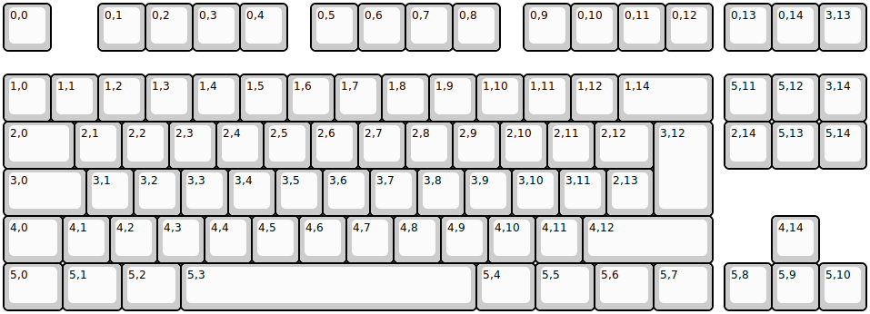
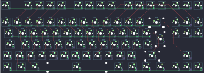

## poker87d/poker87d

[layout](poker87d-kle.json) - [PCB](poker87d.kicad_pcb)

{:loading="lazy"}

[Open in keyboard-layout-editor](http://www.keyboard-layout-editor.com/##@@=0,0&_x:1.0;&=0,1&=0,2&=0,3&=0,4&_x:0.5;&=0,5&=0,6&=0,7&=0,8&_x:0.5;&=0,9&=0,10&=0,11&=0,12&_x:0.25;&=0,13&=0,14&=3,13;&@_y:0.5;&=1,0&=1,1&=1,2&=1,3&=1,4&=1,5&=1,6&=1,7&=1,8&=1,9&=1,10&=1,11&=1,12&_w:2;&=1,14&_x:0.25;&=5,11&=5,12&=3,14;&@_w:1.5;&=2,0&=2,1&=2,2&=2,3&=2,4&=2,5&=2,6&=2,7&=2,8&=2,9&=2,10&=2,11&_w:1.25;&=2,12&_w:1.25&h:2.0;&=3,12&_x:0.25;&=2,14&=5,13&=5,14;&@_w:1.75;&=3,0&=3,1&=3,2&=3,3&=3,4&=3,5&=3,6&=3,7&=3,8&=3,9&=3,10&=3,11&=2,13;&@_w:1.25;&=4,0&=4,1&=4,2&=4,3&=4,4&=4,5&=4,6&=4,7&=4,8&=4,9&=4,10&=4,11&_w:2.75;&=4,12&_x:1.25;&=4,14;&@_w:1.25;&=5,0&_w:1.25;&=5,1&_w:1.25;&=5,2&_w:6.25;&=5,3&_w:1.25;&=5,4&_w:1.25;&=5,5&_w:1.25;&=5,6&_w:1.25;&=5,7&_x:0.25;&=5,8&=5,9&=5,10)

{:loading="lazy"}

