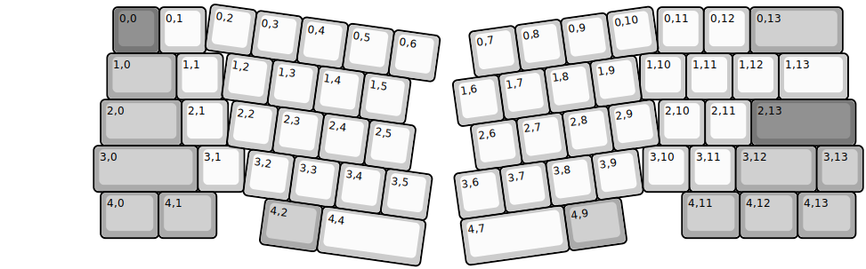
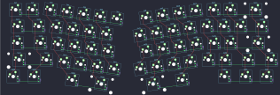

## primekb/meridian_rgb

[layout](meridian_rgb-kle.json) - [PCB](meridian_rgb.kicad_pcb)

{:loading="lazy"}

[Open in keyboard-layout-editor](http://www.keyboard-layout-editor.com/##@@_x:2.37&y:0.08&c=#777777;&=0,0&_c=#cccccc;&=0,1&_x:9.76;&=0,11&=0,12&_c=#aaaaaa&w:2;&=0,13;&@_x:2.24&w:1.5;&=1,0&_c=#cccccc;&=1,1&_x:9.01;&=1,10&=1,11&=1,12&_w:1.5;&=1,13;&@_x:2.1&c=#aaaaaa&w:1.75;&=2,0&_c=#cccccc;&=2,1&_x:9.31;&=2,10&=2,11&_c=#777777&w:2.25;&=2,13;&@_x:1.95&c=#aaaaaa&w:2.25;&=3,0&_c=#cccccc;&=3,1&_x:8.62;&=3,10&=3,11&_c=#aaaaaa&w:1.75;&=3,12&=3,13;&@_x:2.1&w:1.25;&=4,0&_w:1.25;&=4,1&_x:10.06&w:1.25;&=4,11&_w:1.25;&=4,12&_w:1.25;&=4,13;&@_r:8&rx:4.5&c=#cccccc;&=0,2&=0,3&=0,4&=0,5&=0,6;&@_x:0.5;&=1,2&=1,3&=1,4&=1,5;&@_x:0.75;&=2,2&=2,3&=2,4&=2,5;&@_x:1.25;&=3,2&=3,3&=3,4&=3,5;&@_x:1.75&c=#aaaaaa&w:1.25;&=4,2&_c=#cccccc&w:2.25;&=4,4;&@_r:-8&rx:14.5&x:-4.5;&=0,7&=0,8&=0,9&=0,10;&@_x:-5.0;&=1,6&=1,7&=1,8&=1,9;&@_x:-4.75;&=2,6&=2,7&=2,8&=2,9;&@_x:-5.25;&=3,6&=3,7&=3,8&=3,9;&@_x:-5.25&w:2.25;&=4,7&_c=#aaaaaa&w:1.25;&=4,9)

{:loading="lazy"}

