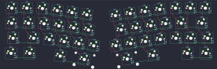

## primekb/prime_e

[layout](prime_e-kle.json) - [PCB](prime_e.kicad_pcb)

{:loading="lazy"}

[Open in keyboard-layout-editor](http://www.keyboard-layout-editor.com/##@@_rx:6.25&x:0.85&y:0.46&c=#777777;&=0,0&_c=#cccccc;&=0,1&_x:8.95;&=0,10&_c=#aaaaaa;&=0,11&=0,12;&@_x:0.71&y:0.01&w:1.26;&=1,0&_x:-0.01&c=#cccccc;&=1,1&_x:9.23;&=1,10&_c=#777777&w:1.75;&=1,12;&@_x:0.56&y:0.01&c=#aaaaaa&w:1.75;&=2,0&_c=#cccccc;&=2,1&_x:8.52;&=2,10&=2,11&_c=#aaaaaa&w:1.25;&=2,12;&@_x:0.67&y:0.01&w:1.25;&=3,0&_w:1.25;&=3,1&_x:9.3&w:1.25;&=3,11&_w:1.25;&=3,12;&@_r:8&x:3.0&y:-4.49&c=#cccccc;&=0,2&=0,3&=0,4&=0,5;&@_x:3.25;&=1,2&=1,3&=1,4&=1,5;&@_x:3.75;&=2,2&=2,3&=2,4&=2,5;&@_x:4.5&c=#aaaaaa&w:1.25;&=3,3&_c=#cccccc&w:2;&=3,4;&@_r:-8&x:7.5&y:-1.9;&=0,6&=0,7&=0,8&=0,9;&@_x:7.75;&=1,6&=1,7&=1,8&=1,9;&@_x:7.25&c=#aaaaaa;&=2,6&_c=#cccccc;&=2,7&=2,8&=2,9;&@_x:7.25&w:2.25;&=3,6&_c=#aaaaaa&w:1.25;&=3,8)

{:loading="lazy"}

