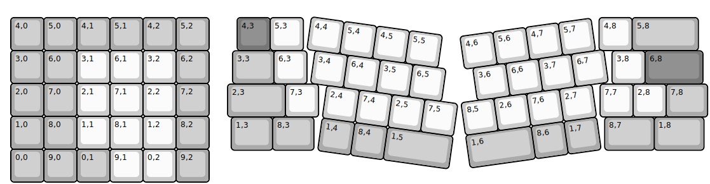
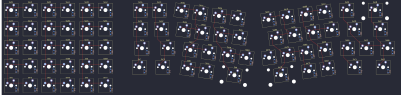

## primekb/prime_exl

[layout](prime_exl-kle.json) - [PCB](prime_exl.kicad_pcb)

{:loading="lazy"}

[Open in keyboard-layout-editor](http://www.keyboard-layout-editor.com/##@@_x:0.25&y:0.46&c=#aaaaaa;&=4,0&=5,0&=4,1&=5,1&=4,2&=5,2;&@_x:0.25;&=3,0&=6,0&_c=#cccccc;&=3,1&=6,1&=3,2&_c=#aaaaaa;&=6,2;&@_x:0.25;&=2,0&=7,0&_c=#cccccc;&=2,1&=7,1&=2,2&_c=#aaaaaa;&=7,2;&@_x:0.25;&=1,0&=8,0&_c=#cccccc;&=1,1&=8,1&=1,2&_c=#aaaaaa;&=8,2;&@_x:0.25;&=0,0&=9,0&=0,1&_c=#cccccc;&=9,1&=0,2&_c=#aaaaaa;&=9,2;&@_rx:6.25&x:0.85&y:0.46&c=#777777;&=4,3&_c=#cccccc;&=5,3&_x:8.95;&=4,8&_c=#aaaaaa&w:2;&=5,8;&@_x:0.71&y:0.01&w:1.26;&=3,3&_x:-0.01&c=#cccccc;&=6,3&_x:9.23;&=3,8&_c=#777777&w:1.75;&=6,8;&@_x:0.56&y:0.01&c=#aaaaaa&w:1.75;&=2,3&_c=#cccccc;&=7,3&_x:8.52;&=7,7&=2,8&_c=#aaaaaa&w:1.25;&=7,8;&@_x:0.67&y:0.01&w:1.25;&=1,3&_w:1.25;&=8,3&_x:8.8&w:1.5;&=8,7&_w:1.5;&=1,8;&@_r:8&ry:1&x:3.0&y:-1&c=#cccccc;&=4,4&=5,4&=4,5&=5,5;&@_x:3.25;&=3,4&=6,4&=3,5&=6,5;&@_x:3.75;&=2,4&=7,4&=2,5&=7,5;&@_x:3.75&c=#aaaaaa;&=1,4&=8,4&_w:2;&=1,5;&@_r:-8&x:7.5&y:-1.9&c=#cccccc;&=4,6&=5,6&=4,7&=5,7;&@_x:7.75;&=3,6&=6,6&=3,7&=6,7;&@_x:7.25;&=8,5&=2,6&=7,6&=2,7;&@_x:7.25&c=#aaaaaa&w:2;&=1,6&=8,6&=1,7)

{:loading="lazy"}

