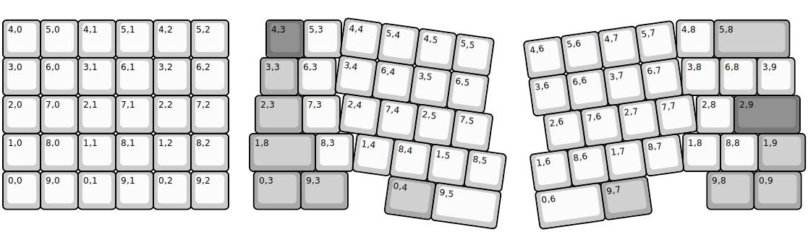
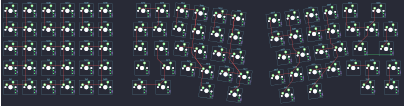

## primekb/prime_exl_plus

[layout](prime_exl_plus-kle.json) - [PCB](prime_exl_plus.kicad_pcb)

{:loading="lazy"}

[Open in keyboard-layout-editor](http://www.keyboard-layout-editor.com/##@@_y:0.46;&=4,0&=5,0&=4,1&=5,1&=4,2&=5,2;&@=3,0&=6,0&=3,1&=6,1&=3,2&=6,2;&@_y:0.01;&=2,0&=7,0&=2,1&=7,1&=2,2&=7,2;&@_y:0.01;&=1,0&=8,0&=1,1&=8,1&=1,2&=8,2;&@_y:0.01;&=0,0&=9,0&=0,1&=9,1&=0,2&=9,2;&@_rx:6.25&x:0.75&y:0.46&c=#777777;&=4,3&_c=#cccccc;&=5,3&_x:8.91;&=4,8&_c=#aaaaaa&w:2;&=5,8;&@_x:0.6;&=3,3&_c=#cccccc;&=6,3&_x:9.2;&=3,8&=6,8&=3,9;&@_x:0.46&y:0.01&c=#aaaaaa&w:1.26;&=2,3&_x:-0.01&c=#cccccc;&=7,3&_x:9.48;&=2,8&_c=#777777&w:1.75;&=2,9;&@_x:0.31&y:0.01&c=#aaaaaa&w:1.75;&=1,8&_c=#cccccc;&=8,3&_x:8.77;&=1,8&=8,8&_c=#aaaaaa&w:1.25;&=1,9;&@_x:0.42&y:0.01&w:1.25;&=0,3&_w:1.25;&=9,3&_x:9.55&w:1.25;&=9,8&_w:1.25;&=0,9;&@_r:8&ry:1&x:2.75&y:-1&c=#cccccc;&=4,4&=5,4&=4,5&=5,5;&@_x:2.75;&=3,4&=6,4&=3,5&=6,5;&@_x:3.0;&=2,4&=7,4&=2,5&=7,5;&@_x:3.5;&=1,4&=8,4&=1,5&=8,5;&@_x:4.5&c=#aaaaaa&w:1.25;&=0,4&_c=#cccccc&w:1.75;&=9,5;&@_r:-8&x:7.5&y:-2.9;&=4,6&=5,6&=4,7&=5,7;&@_x:7.5;&=3,6&=6,6&=3,7&=6,7;&@_x:7.75;&=2,6&=7,6&=2,7&=7,7;&@_x:7.25;&=1,6&=8,6&=1,7&=8,7;&@_x:7.25&w:1.75;&=0,6&_c=#aaaaaa&w:1.25;&=9,7)

{:loading="lazy"}

