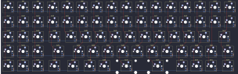

## primekb/prime_l

[layout](prime_l-kle.json) - [PCB](prime_l.kicad_pcb)

{:loading="lazy"}

[Open in keyboard-layout-editor](http://www.keyboard-layout-editor.com/##@@_c=#777777;&=0,0&_c=#aaaaaa;&=0,1&=0,2&=0,3&_c=#cccccc;&=0,4&=0,5&=0,6&=0,7&=0,8&=0,9&=0,10&=0,11&=0,12&=0,13&_c=#aaaaaa;&=0,14&=0,15;&@_c=#cccccc;&=1,0&=1,1&=1,2&_c=#aaaaaa;&=1,3&_c=#cccccc;&=1,4&=1,5&=1,6&=1,7&=1,8&=1,9&=1,10&=1,11&=1,12&=1,13&_c=#aaaaaa;&=1,14&=1,15;&@_c=#cccccc;&=2,0&=2,1&=2,2&_c=#aaaaaa&w:1.25;&=2,3&_c=#cccccc;&=2,4&=2,5&=2,6&=2,7&=2,8&=2,9&=2,10&=2,11&=2,12&=2,13&_c=#777777&w:1.75;&=2,15;&@_c=#cccccc;&=3,0&=3,1&=3,2&_c=#aaaaaa&w:1.75;&=3,3&_c=#cccccc;&=3,5&=3,6&=3,7&=3,8&=3,9&=3,10&=3,11&=3,12&=3,13&=3,14&_c=#aaaaaa&w:1.25;&=3,15;&@_c=#cccccc;&=4,0&=4,1&=4,2&_c=#aaaaaa&w:1.25;&=4,3&_w:1.25;&=4,5&=4,6&=4,7&_c=#cccccc&w:2;&=4,8&_w:2.25;&=4,10&_c=#aaaaaa;&=4,12&=4,13&=4,14&_w:1.25;&=4,15)

{:loading="lazy"}

