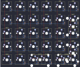

## primekb/prime_m

[layout](prime_m-kle.json) - [PCB](prime_m.kicad_pcb)

{:loading="lazy"}

[Open in keyboard-layout-editor](http://www.keyboard-layout-editor.com/##@@_c=#aaaaaa;&=0,0&=0,1&=0,2&=0,3&=0,4&=0,5;&@=1,0&=1,1&_c=#cccccc;&=1,2&=1,3&=1,4&_c=#aaaaaa;&=1,5%0A%0A%0A2,0;&@=2,0&=2,1&_c=#cccccc;&=2,2&=2,3&=2,4&_c=#aaaaaa;&=2,5%0A%0A%0A2,0;&@=3,0&=3,1&_c=#cccccc;&=3,2&=3,3&=3,4&_c=#aaaaaa;&=3,5%0A%0A%0A1,0;&@=4,0&=4,1&_c=#cccccc;&=4,2%0A%0A%0A0,0&=4,3%0A%0A%0A0,0&=4,4%0A%0A%0A1,0&_c=#777777;&=4,5%0A%0A%0A1,0;&@_x:6.25&y:-4&c=#aaaaaa&h:2;&=1,5%0A%0A%0A2,1;&@_x:7.25&y:1;&=3,5%0A%0A%0A1,1&_x:1.25&c=#777777&h:2;&=3,5%0A%0A%0A1,2;&@_x:6.25&w:2;&=4,4%0A%0A%0A1,1&_x:0.25&c=#cccccc;&=4,4%0A%0A%0A1,2;&@_x:2&y:0.25&w:2;&=4,2%0A%0A%0A0,1)

{:loading="lazy"}

