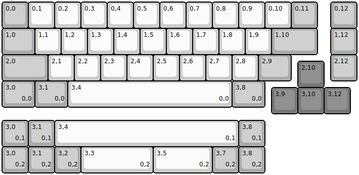
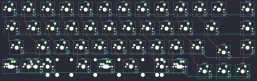

## program_yoink/program_yoink

[layout](program_yoink-kle.json) - [PCB](program_yoink.kicad_pcb)

{:loading="lazy"}

[Open in keyboard-layout-editor](http://www.keyboard-layout-editor.com/##@@_c=#aaaaaa;&=0,0&_c=#cccccc;&=0,1&=0,2&=0,3&=0,4&=0,5&=0,6&=0,7&=0,8&=0,9&=0,10&_c=#aaaaaa;&=0,11&_x:0.5;&=0,12;&@_w:1.25;&=1,0&_c=#cccccc;&=1,1&=1,2&=1,3&=1,4&=1,5&=1,6&=1,7&=1,8&=1,9&_c=#aaaaaa&w:1.75;&=1,10&_x:0.5;&=1,12;&@_w:1.75;&=2,0&_c=#cccccc;&=2,1&=2,2&=2,3&=2,4&=2,5&=2,6&=2,7&=2,8%0A.&_c=#aaaaaa&w:1.25;&=2,9&_x:1.5;&=2,12;&@_x:11.25&y:-0.75&c=#777777;&=2,10;&@_y:-0.25&c=#aaaaaa&w:1.25;&=3,0%0A%0A%0A0,0&_w:1.25;&=3,1%0A%0A%0A0,0&_c=#cccccc&w:6.25;&=3,4%0A%0A%0A0,0&_c=#aaaaaa&w:1.25;&=3,8%0A%0A%0A0,0;&@_x:10.25&y:-0.75&c=#777777;&=3,9&=3,10&=3,12;&@_y:0.25&c=#aaaaaa;&=3,0%0A%0A%0A0,1&=3,1%0A%0A%0A0,1&_c=#cccccc&w:7;&=3,4%0A%0A%0A0,1&_c=#aaaaaa;&=3,8%0A%0A%0A0,1;&@=3,0%0A%0A%0A0,2&=3,1%0A%0A%0A0,2&=3,2%0A%0A%0A0,2&_c=#cccccc&w:2.75;&=3,3%0A%0A%0A0,2&_w:2.25;&=3,5%0A%0A%0A0,2&_c=#aaaaaa;&=3,7%0A%0A%0A0,2&=3,8%0A%0A%0A0,2)

{:loading="lazy"}

