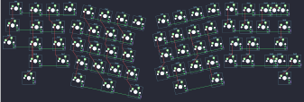
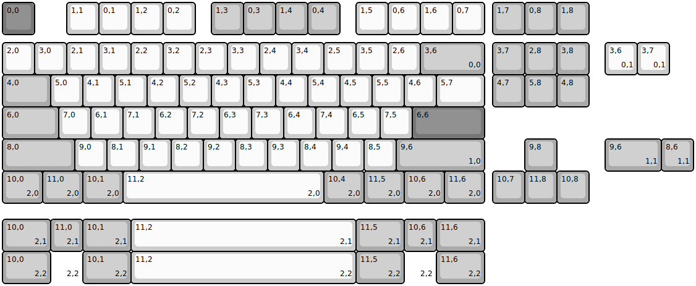
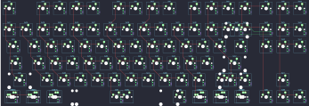

## projectkb/alice/projectkb_alice

[layout](projectkb_alice-kle.json) - [PCB](projectkb_alice.kicad_pcb)

{:loading="lazy"}

[Open in keyboard-layout-editor](http://www.keyboard-layout-editor.com/##@@_x:0.55&y:1.15&c=#777777;&=0,0;&@_x:3.7&y:-0.95&c=#cccccc;&=0,3&_x:8.45;&=0,12;&@_x:1.7&y:-0.95;&=0,1&=0,2&_x:10.45;&=0,13&=0,14%0A%0A%0A0,0&_c=#aaaaaa;&=0,15%0A%0A%0A0,0;&@_x:0.35&y:-0.1;&=1,0;&@_x:13&y:-0.95&c=#cccccc;&=1,12;&@_x:1.5&y:-0.95&c=#aaaaaa&w:1.5;&=1,1&_c=#cccccc;&=1,2&_x:10.0;&=1,13&=1,14&_c=#aaaaaa&w:1.5;&=1,15;&@_x:0.15&y:-0.1;&=2,0;&@_x:13.4&y:-0.9&c=#cccccc;&=2,12&=2,13&_c=#777777&w:2.25;&=2,15&_x:-16.35&c=#aaaaaa&w:1.75;&=2,1&_c=#cccccc;&=2,2;&@_x:1.05&c=#aaaaaa&w:2.25;&=3,1&_c=#cccccc;&=3,2&_x:8.8;&=3,12&=3,13&_c=#aaaaaa&w:1.75;&=3,14%0A%0A%0A1,0&=3,15%0A%0A%0A1,0;&@_x:1.05&w:1.5;&=4,1&_x:13.45&w:1.5;&=4,15;&@_r:12&x:5.05&y:-6.0&c=#cccccc;&=0,4&=0,5&=0,6&=0,7;&@_x:4.6;&=1,3&=1,4&=1,5&=1,6;&@_x:4.85;&=2,3&=2,4&=2,5&=2,6;&@_x:5.3;&=3,3&=3,4&=3,5&=3,6;&@_x:6.6&c=#777777&w:2;&=4,4&_c=#aaaaaa&w:1.25;&=4,6;&@_x:5.05&y:-0.95&w:1.5;&=4,3;&@_r:-12&x:8.45&y:-1.45&c=#cccccc;&=0,8&=0,9&=0,10&=0,11;&@_x:8.05;&=1,8&=1,9&=1,10&=1,11;&@_x:8.2;&=2,8&=2,9&=2,10&=2,11;&@_x:7.75;&=3,8&=3,9&=3,10&=3,11;&@_x:7.75&c=#777777&w:2.75;&=4,9;&@_x:10.55&y:-0.95&c=#aaaaaa&w:1.5;&=4,11;&@_r:0&x:15.15&y:-8.75&w:2;&=0,15%0A%0A%0A0,1;&@_x:18.15&y:3.1&w:2.75;&=3,14%0A%0A%0A1,1)

{:loading="lazy"}

## projectkb/alice/signature87

[layout](signature87-kle.json) - [PCB](signature87.kicad_pcb)

{:loading="lazy"}

[Open in keyboard-layout-editor](http://www.keyboard-layout-editor.com/##@@_c=#777777;&=0,0&_x:1&c=#cccccc;&=1,1&=0,1&=1,2&=0,2&_x:0.5&c=#aaaaaa;&=1,3&=0,3&=1,4&=0,4&_x:0.5&c=#cccccc;&=1,5&=0,6&=1,6&=0,7&_x:0.25&c=#aaaaaa;&=1,7&=0,8&=1,8;&@_y:0.25&c=#cccccc;&=2,0&=3,0&=2,1&=3,1&=2,2&=3,2&=2,3&=3,3&=2,4&=3,4&=2,5&=3,5&=2,6&_c=#aaaaaa&w:2;&=3,6%0A%0A%0A0,0&_x:0.25;&=3,7&=2,8&=3,8;&@_w:1.5;&=4,0&_c=#cccccc;&=5,0&=4,1&=5,1&=4,2&=5,2&=4,3&=5,3&=4,4&=5,4&=4,5&=5,5&=4,6&_w:1.5;&=5,7&_x:0.25&c=#aaaaaa;&=4,7&=5,8&=4,8;&@_w:1.75;&=6,0&_c=#cccccc;&=7,0&=6,1&=7,1&=6,2&=7,2&=6,3&=7,3&=6,4&=7,4&=6,5&=7,5&_c=#777777&w:2.25;&=6,6;&@_c=#aaaaaa&w:2.25;&=8,0&_c=#cccccc;&=9,0&=8,1&=9,1&=8,2&=9,2&=8,3&=9,3&=8,4&=9,4&=8,5&_c=#aaaaaa&w:2.75;&=9,6%0A%0A%0A1,0&_x:1.25;&=9,8;&@_w:1.25;&=10,0%0A%0A%0A2,0&_w:1.25;&=11,0%0A%0A%0A2,0&_w:1.25;&=10,1%0A%0A%0A2,0&_c=#cccccc&w:6.25;&=11,2%0A%0A%0A2,0&_c=#aaaaaa&w:1.25;&=10,4%0A%0A%0A2,0&_w:1.25;&=11,5%0A%0A%0A2,0&_w:1.25;&=10,6%0A%0A%0A2,0&_w:1.25;&=11,6%0A%0A%0A2,0&_x:0.25;&=10,7&=11,8&=10,8;&@_x:18.75&y:-5.0&c=#cccccc;&=3,6%0A%0A%0A0,1&=3,7%0A%0A%0A0,1;&@_x:18.75&y:2.0&c=#aaaaaa&w:1.75;&=9,6%0A%0A%0A1,1&=8,6%0A%0A%0A1,1;&@_y:1.5&w:1.5;&=10,0%0A%0A%0A2,1&=11,0%0A%0A%0A2,1&_w:1.5;&=10,1%0A%0A%0A2,1&_c=#cccccc&w:7;&=11,2%0A%0A%0A2,1&_c=#aaaaaa&w:1.5;&=11,5%0A%0A%0A2,1&=10,6%0A%0A%0A2,1&_w:1.5;&=11,6%0A%0A%0A2,1;&@_w:1.5;&=10,0%0A%0A%0A2,2&_c=#cccccc&d:true;&=%0A%0A%0A2,2&_c=#aaaaaa&w:1.5;&=10,1%0A%0A%0A2,2&_c=#cccccc&w:7;&=11,2%0A%0A%0A2,2&_c=#aaaaaa&w:1.5;&=11,5%0A%0A%0A2,2&_c=#cccccc&d:true;&=%0A%0A%0A2,2&_c=#aaaaaa&w:1.5;&=11,6%0A%0A%0A2,2)

{:loading="lazy"}

