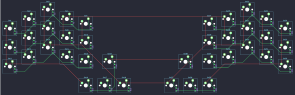

## pteron36/pteron36

[layout](pteron36-kle.json) - [PCB](pteron36.kicad_pcb)

{:loading="lazy"}

[Open in keyboard-layout-editor](http://www.keyboard-layout-editor.com/##@@_x:2;&=0,2&_x:9.5;&=4,2;&@_x:1&y:-0.5;&=0,1&_x:1;&=0,3&_x:7.5;&=4,3&_x:1.0;&=4,1;&@_x:4&y:-0.75;&=0,4&_x:5.5;&=4,4;&@_y:-0.75;&=0,0&_x:1;&=1,2&_x:9.5;&=5,2&_x:1.0;&=4,0;&@_x:1&y:-0.5;&=1,1&_x:1;&=1,3&_x:7.5;&=5,3&_x:1.0;&=5,1;&@_x:4&y:-0.75;&=1,4&_x:5.5;&=5,4;&@_y:-0.75;&=1,0&_x:1;&=2,2&_x:9.5;&=6,2&_x:1.0;&=5,0;&@_x:1&y:-0.5;&=2,1&_x:1;&=2,3&_x:7.5;&=6,3&_x:1.0;&=6,1;&@_x:4&y:-0.75;&=2,4&_x:0.25;&=3,4&_x:3.0;&=7,4&_x:0.25;&=6,4;&@_y:-0.75;&=2,0&_x:13.5;&=6,0;&@_x:4&c=#aaaaaa;&=3,0&_c=#777777;&=3,1&_c=#aaaaaa;&=3,2&_x:1.5;&=7,2&_c=#777777;&=7,1&_c=#aaaaaa;&=7,0)

{:loading="lazy"}

